# Crate Dependency Graph

`or-core` is the most foundational crate in the workspace: it has zero internal dependencies and the broadest set of direct dependents. `or-bridge` is the native binding gateway, `or-sentinel` sits deepest in the runtime stack by combining provider, tool, and graph crates, and the newer additive crates `or-schema`, `or-lens`, and `or-cli` extend descriptors, local observability, and project tooling.

## Workspace Graph

```mermaid
graph TB
  classDef gateway fill:#f7d774,stroke:#7a5d00,color:#111;
  classDef optional stroke-dasharray: 5 5;

  PY[bindings/python] --> OR_BRIDGE[or-bridge]
  TS[bindings/typescript] --> OR_BRIDGE
  DART[bindings/dart] --> OR_BRIDGE
  class OR_BRIDGE gateway;

  OR_ANCHOR[or-anchor] --> OR_CORE[or-core]
  OR_BEACON[or-beacon] --> OR_CORE
  OR_CHECKPOINT[or-checkpoint] --> OR_CORE
  OR_COLONY[or-colony] --> OR_CORE
  OR_COMPASS[or-compass] --> OR_CORE
  OR_CONDUIT[or-conduit] --> OR_CORE
  OR_LOOM[or-loom] --> OR_CORE
  OR_MCP[or-mcp] --> OR_CORE
  OR_PIPELINE[or-pipeline] --> OR_CORE
  OR_RECALL[or-recall] --> OR_CORE
  OR_RELAY[or-relay] --> OR_CORE
  OR_TOOLS_VECTOR[or-tools-vector] --> OR_CORE

  OR_BRIDGE --> OR_BEACON
  OR_BRIDGE --> OR_CONDUIT
  OR_BRIDGE --> OR_CORE
  OR_BRIDGE --> OR_LOOM
  OR_BRIDGE --> OR_PRISM[or-prism]
  OR_BRIDGE --> OR_SIEVE[or-sieve]
  OR_BRIDGE --> OR_TOOLS[or-tools-*]

  OR_FORGE[or-forge] --> OR_MCP
  OR_SENTINEL[or-sentinel] --> OR_CONDUIT
  OR_SENTINEL --> OR_CORE
  OR_SENTINEL --> OR_FORGE
  OR_SENTINEL --> OR_LOOM

  OR_TOOLS_SEARCH[or-tools-search] --> OR_TOOLS_CORE[or-tools-core]
  OR_TOOLS_WEB[or-tools-web] --> OR_TOOLS_CORE
  OR_TOOLS_LOADERS[or-tools-loaders] --> OR_TOOLS_CORE
  OR_TOOLS_EXEC[or-tools-exec] --> OR_TOOLS_CORE
  OR_TOOLS_FILE[or-tools-file] --> OR_TOOLS_CORE
  OR_TOOLS_COMMS[or-tools-comms] --> OR_TOOLS_CORE
  OR_TOOLS_PRODUCTIVITY[or-tools-productivity] --> OR_TOOLS_CORE
  OR_TOOLS_VECTOR --> OR_TOOLS_CORE

  OR_LOOM -. feature serde .-> OR_SCHEMA[or-schema]
  OR_PRISM -. feature lens .-> OR_LENS[or-lens]
  OR_CLI[or-cli] --> OR_SCHEMA
  OR_CLI --> OR_LENS

  class OR_SCHEMA,OR_LENS optional;
```

## Internal Dependency Table

| Crate | Internal deps | Notes |
|---|---|---|
| `or-core` | `(none)` | Shared state, retry, and budget foundation. |
| `or-anchor` | `or-core` | Retrieval pipeline on top of core state. |
| `or-beacon` | `or-core` | Prompt templating and validation. |
| `or-bridge` | `or-beacon`, `or-conduit`, `or-core`, `or-loom`, `or-prism`, `or-sieve`, `or-tools-*` | Binding gateway for Python, TypeScript, and Dart. |
| `or-checkpoint` | `or-core` | Checkpoint pause/resume state handling. |
| `or-cli` | `or-lens`, `or-schema` | Project scaffolding, linting, and trace bootstrap. |
| `or-colony` | `or-core` | Multi-agent coordination. |
| `or-compass` | `or-core` | Predicate routing. |
| `or-conduit` | `or-core` | LLM provider abstraction. |
| `or-forge` | `or-mcp` | Tool registry and MCP import adapters. |
| `or-lens` | `(none)` | Feature-gated local dashboard crate. |
| `or-loom` | `or-core`, `or-schema` (feature=`serde`) | Graph execution engine with optional descriptor compilation. |
| `or-mcp` | `or-core` | MCP client, server, and multi-server discovery. |
| `or-pipeline` | `or-core` | Sequential pipeline runtime. |
| `or-prism` | `or-lens` (feature=`lens`) | Tracing bootstrap with optional local dashboard bridge. |
| `or-recall` | `or-core` | Memory stores. |
| `or-relay` | `or-core` | Parallel branch execution. |
| `or-schema` | `(none)` | Serializable graph descriptors. |
| `or-sentinel` | `or-conduit`, `or-core`, `or-forge`, `or-loom` | Agent runtime with additive loop topologies. |
| `or-sieve` | `(none)` | Structured-output and text parsing. |
| `or-tools-core` | `(none)` | Shared tool traits and registry. |
| `or-tools-search` | `or-tools-core` | Search integrations. |
| `or-tools-web` | `or-tools-core` | Web fetch and scraping integrations. |
| `or-tools-vector` | `or-core`, `or-tools-core` | Vector store integrations. |
| `or-tools-loaders` | `or-tools-core` | Document loaders. |
| `or-tools-exec` | `or-tools-core` | Code execution integrations. |
| `or-tools-file` | `or-tools-core` | File and external data integrations. |
| `or-tools-comms` | `or-tools-core` | Messaging integrations. |
| `or-tools-productivity` | `or-tools-core` | Productivity integrations. |

## Why This Structure Was Chosen

- Shared contracts live low in the graph so higher-level runtime crates can compose them without cycles.
- Execution-model crates layer progressively from sequential flow to graph and agent behavior.
- Binding dependencies are isolated in `or-bridge` so the rest of the workspace does not pay for PyO3, NAPI, or C-ABI concerns.
- Additive developer tooling (`or-schema`, `or-lens`, `or-cli`) extends the workspace without renaming or replacing the older runtime crates.

## Known Gaps & Limitations

- This graph focuses on internal Cargo relationships and feature-gated edges, not every external dependency.
- The tool family is summarized as `or-tools-*` in the diagram to keep it readable.
