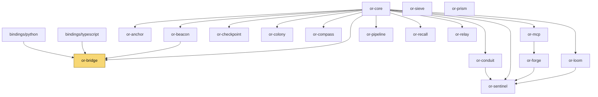

# Crate Dependency Graph

`or-core` is the most foundational crate in the workspace: it has zero internal dependencies and the highest number of direct dependents. `or-bridge` is the native binding gateway, and `or-sentinel` sits deepest in the runtime stack by combining provider, tool, and graph crates.

## Workspace Graph

## External Dependencies per Internal Crate

| Crate | Internal deps | External deps | Direct dependents |
|---|---|---|---|
| `or-core` | `(none)` | rand, serde, serde_json, thiserror, tokio, tracing | or-anchor, or-beacon, or-bridge, or-checkpoint, or-colony, or-compass, or-conduit, or-loom, or-mcp, or-pipeline, or-recall, or-relay, or-sentinel |
| `or-anchor` | or-core | serde, serde_json, thiserror, tracing | `(none)` |
| `or-beacon` | or-core | serde, serde_json, thiserror, tracing | or-bridge |
| `or-bridge` | or-beacon, or-core | serde, serde_json, thiserror, tracing, pyo3(feature), napi(feature) | bindings/python, bindings/typescript (conceptual native target) |
| `or-checkpoint` | or-core | serde, serde_json, thiserror, tracing | `(none)` |
| `or-colony` | or-core | serde, serde_json, thiserror, tracing | `(none)` |
| `or-compass` | or-core | serde, thiserror, tracing | `(none)` |
| `or-conduit` | or-core | futures, reqwest, serde, serde_json, thiserror, tokio, tracing | or-sentinel |
| `or-forge` | or-mcp | schemars, serde, serde_json, thiserror, tracing | or-sentinel |
| `or-loom` | or-core | serde, thiserror, tracing | or-sentinel |
| `or-mcp` | or-core | reqwest, schemars, serde, serde_json, thiserror, tokio, tracing | or-forge |
| `or-pipeline` | or-core | serde, thiserror, tracing | `(none)` |
| `or-prism` | `(none)` | opentelemetry, opentelemetry-otlp, opentelemetry_sdk, reqwest, serde, thiserror, tokio, tracing, tracing-opentelemetry, tracing-subscriber | `(none)` |
| `or-recall` | or-core | serde, serde_json, thiserror, tokio, tracing, sqlx(feature) | `(none)` |
| `or-relay` | or-core | futures, serde, thiserror, tracing | `(none)` |
| `or-sentinel` | or-conduit, or-core, or-forge, or-loom | serde, serde_json, thiserror, tokio, tracing | `(none)` |
| `or-sieve` | `(none)` | schemars, serde, serde_json, thiserror, tracing | `(none)` |

## Dependency Depth Analysis

- **Most foundational**: `or-core` supplies state contracts, retry policy, and in-memory backing implementations to the rest of the workspace.
- **Binding gateway**: `or-bridge` is the only Rust crate that directly carries both PyO3 and NAPI feature flags.
- **Deepest runtime**: `or-sentinel` depends on provider, tool, and graph crates to implement agent behavior.
- **Independent support crates**: `or-sieve` and `or-prism` do not depend on internal crates today.

## Why This Structure Was Chosen

- Shared contracts live low in the graph so higher-level runtime crates can compose them without cycles.
- Execution-model crates (`or-pipeline`, `or-relay`, `or-loom`, `or-sentinel`) layer progressively from sequential flow to graph and agent behavior.
- FFI dependencies are isolated in `or-bridge` so the rest of the workspace does not pay for binding-specific dependencies.

⚠️ Known Gaps & Limitations
- This graph reflects Cargo manifest relationships and code structure as scanned, not future planned crates or features.
- Some conceptual dependents, such as the TypeScript package's relationship to `or-bridge`, are weaker in practice because the current package is still a pure JS facade.
