# Crate Dependency Graph

`or-core` is the most foundational crate in the workspace: it has zero internal dependencies and the highest number of direct dependents. `or-bridge` is the native binding gateway, and `or-sentinel` sits deepest in the runtime stack by combining provider, tool, and graph crates.

## Workspace Graph

```mermaid
graph TB
  classDef gateway fill:#f7d774,stroke:#7a5d00,color:#111;

  PY[bindings/python] --> OR_BRIDGE[or-bridge]
  TS[bindings/typescript] --> OR_BRIDGE
  DART[bindings/dart] --> OR_BRIDGE
  class OR_BRIDGE gateway;

  OR_BRIDGE --> OR_BEACON[or-beacon]
  OR_BRIDGE --> OR_CONDUIT[or-conduit]
  OR_BRIDGE --> OR_CORE[or-core]
  OR_BRIDGE --> OR_PRISM[or-prism]
  OR_BRIDGE --> OR_SIEVE[or-sieve]
  OR_BRIDGE --> OR_TOOLS[or-tools-*]

  OR_ANCHOR[or-anchor] --> OR_CORE
  OR_BEACON --> OR_CORE
  OR_CHECKPOINT[or-checkpoint] --> OR_CORE
  OR_COLONY[or-colony] --> OR_CORE
  OR_COMPASS[or-compass] --> OR_CORE
  OR_CONDUIT --> OR_CORE

  OR_FORGE[or-forge] --> OR_MCP[or-mcp]
  OR_MCP --> OR_CORE

  OR_LOOM[or-loom] --> OR_CORE
  OR_PIPELINE[or-pipeline] --> OR_CORE
  OR_RECALL[or-recall] --> OR_CORE
  OR_RELAY[or-relay] --> OR_CORE

  OR_SENTINEL[or-sentinel] --> OR_CONDUIT
  OR_SENTINEL --> OR_CORE
  OR_SENTINEL --> OR_FORGE
  OR_SENTINEL --> OR_LOOM

  OR_TOOLS_SEARCH[or-tools-search] --> OR_TOOLS_CORE[or-tools-core]
  OR_TOOLS_WEB[or-tools-web] --> OR_TOOLS_CORE
  OR_TOOLS_LOADERS[or-tools-loaders] --> OR_TOOLS_CORE
  OR_TOOLS_EXEC[or-tools-exec] --> OR_TOOLS_CORE
  OR_TOOLS_FILE[or-tools-file] --> OR_TOOLS_CORE
  OR_TOOLS_COMMS[or-tools-comms] --> OR_TOOLS_CORE
  OR_TOOLS_PRODUCTIVITY[or-tools-productivity] --> OR_TOOLS_CORE
  OR_TOOLS_VECTOR[or-tools-vector] --> OR_CORE
  OR_TOOLS_VECTOR --> OR_TOOLS_CORE
```

## External Dependencies per Internal Crate

| Crate | Internal deps | External deps | Direct dependents |
|---|---|---|---|
| `or-core` | `(none)` | rand, serde, serde_json, thiserror, tokio, tracing | or-anchor, or-beacon, or-bridge, or-checkpoint, or-colony, or-compass, or-conduit, or-loom, or-mcp, or-pipeline, or-recall, or-relay, or-sentinel, or-tools-vector |
| `or-anchor` | or-core | serde, serde_json, thiserror, tracing | `(none)` |
| `or-beacon` | or-core | serde, serde_json, thiserror, tracing | or-bridge |
| `or-bridge` | or-beacon, or-conduit, or-core, or-prism, or-sieve, or-tools-comms, or-tools-exec, or-tools-file, or-tools-loaders, or-tools-productivity, or-tools-search, or-tools-vector, or-tools-web | serde, serde_json, thiserror, tracing, tokio, reqwest, pyo3(feature), napi(feature) | bindings/python, bindings/typescript, bindings/dart |
| `or-checkpoint` | or-core | serde, serde_json, thiserror, tracing | `(none)` |
| `or-colony` | or-core | serde, serde_json, thiserror, tracing | `(none)` |
| `or-compass` | or-core | serde, thiserror, tracing | `(none)` |
| `or-conduit` | or-core | futures, futures-util, reqwest, reqwest-eventsource, serde, serde_json, thiserror, tokio, tracing | or-sentinel, or-bridge |
| `or-forge` | or-mcp | schemars, serde, serde_json, thiserror, tracing | or-sentinel |
| `or-loom` | or-core | serde, thiserror, tracing | or-sentinel |
| `or-mcp` | or-core | reqwest, schemars, serde, serde_json, thiserror, tokio, tracing | or-forge |
| `or-pipeline` | or-core | serde, thiserror, tracing | `(none)` |
| `or-prism` | `(none)` | opentelemetry, opentelemetry-otlp, opentelemetry_sdk, reqwest, serde, thiserror, tokio, tracing, tracing-opentelemetry, tracing-subscriber | or-bridge |
| `or-recall` | or-core | serde, serde_json, thiserror, tokio, tracing, sqlx(feature) | `(none)` |
| `or-relay` | or-core | futures, serde, thiserror, tracing | `(none)` |
| `or-sentinel` | or-conduit, or-core, or-forge, or-loom | serde, serde_json, thiserror, tokio, tracing | `(none)` |
| `or-sieve` | `(none)` | schemars, serde, serde_json, thiserror, tracing | or-bridge |
| `or-tools-core` | `(none)` | async-trait, schemars, serde, serde_json, thiserror | or-tools-search, or-tools-web, or-tools-vector, or-tools-loaders, or-tools-exec, or-tools-file, or-tools-comms, or-tools-productivity |

## Dependency Depth Analysis

- **Most foundational**: `or-core` supplies state contracts, retry policy, and in-memory backing implementations to the rest of the workspace.
- **Binding gateway**: `or-bridge` is the only Rust crate that directly carries PyO3, NAPI, and C-ABI export concerns for the bindings.
- **Deepest runtime**: `or-sentinel` depends on provider, tool, and graph crates to implement agent behavior.
- **Independent support crates**: `or-sieve` and `or-prism` do not depend on internal crates today.

## Why This Structure Was Chosen

- Shared contracts live low in the graph so higher-level runtime crates can compose them without cycles.
- Execution-model crates (`or-pipeline`, `or-relay`, `or-loom`, `or-sentinel`) layer progressively from sequential flow to graph and agent behavior.
- FFI dependencies are isolated in `or-bridge` so the rest of the workspace does not pay for binding-specific dependencies.

⚠️ Known Gaps & Limitations

- This graph reflects Cargo manifest relationships and code structure as scanned, not future planned crates or features.
- The tool family is summarized here as `or-tools-*` in some places to keep the diagram readable.
