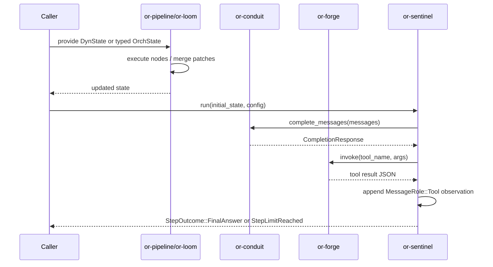
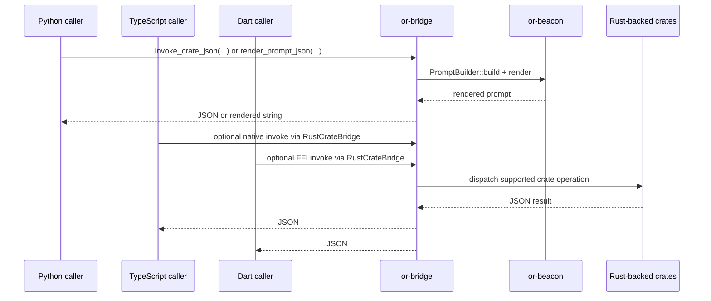

# Data Flow

This page describes how data moves through the current runtime paths that exist in the source tree.

## Rust Request Lifecycle

## Binding Entry Paths

## Data Shapes

- **State**: `DynState` is a JSON-like object map used widely at orchestration and binding boundaries.
- **Messages**: `or-conduit` and `or-sentinel` pass `Vec<CompletionMessage>` with structured content parts.
- **Tool calls**: `or-forge` and `or-mcp` exchange JSON values plus JSON Schema-backed metadata.

⚠️ Known Gaps & Limitations

- Native event streaming is not implemented for provider adapters; `stream_text` falls back to locally chunked final text.
- Some binding flows deliberately stay in the host language rather than going through FFI when the API is callback-heavy or long-lived.
