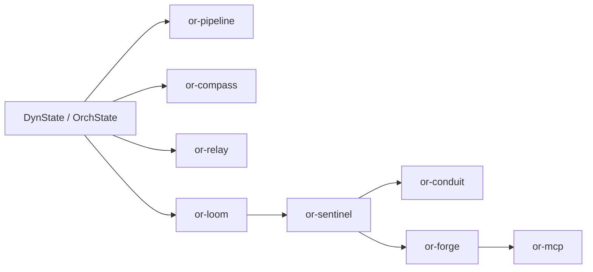

# Execution Model

Orchustr currently implements four execution styles in code: sequential pipelines, predicate routing, concurrent relay branches, and directed graphs. Agent execution in `or-sentinel` composes those pieces rather than inventing a separate execution primitive.

## Execution Layers

- **Pipeline**: ordered async nodes in `or-pipeline`, merged through `OrchState::merge`.
- **Compass**: ordered predicate evaluation in `or-compass` that chooses a route name from state.
- **Relay**: concurrent branch execution in `or-relay`, with deterministic merge order by branch name.
- **Loom**: explicit entry/exit graph execution in `or-loom`, including branch and pause node results.
- **Sentinel**: a graph-backed agent runtime that can use the legacy fixed `SentinelAgent::new(...)` loop or additive `LoopTopology` / `SentinelAgentBuilder` paths.

## Runtime Composition

## Merge Semantics

- `OrchState::merge` is the default merge point for pipelines, relays, and loom nodes.
- `DynState` uses the default replacement merge unless a typed state overrides it.
- Relay merges are deterministic because completed branch patches are sorted by branch name before merge.

## Known Gaps & Limitations

- Router and graph nodes still hold executable closures, so they are not serializable runtime assets on their own.
- `SentinelAgent::new(...)` intentionally keeps the fixed think/act/exit graph for backward compatibility, but the crate now also exposes `LoopTopology` and `SentinelAgentBuilder` for configurable loops.
