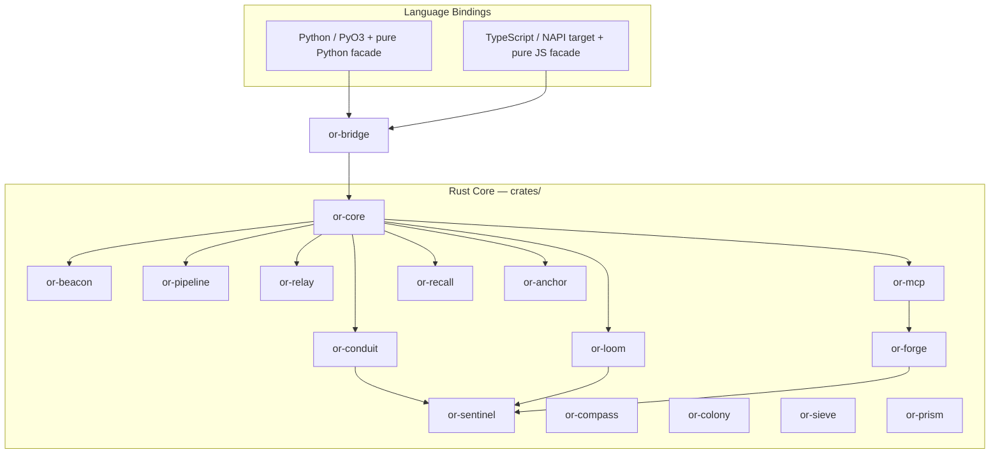

# Architecture Overview

Orchustr is a Rust-first workspace that layers shared contracts, execution runtimes, integrations, and bindings instead of collapsing everything into a single crate. `or-core` anchors state and retry behavior, execution crates build on those primitives, and `or-bridge` forms the native boundary for language bindings.

## Bird's-Eye Diagram

## Layer Summary

- **Foundation**: `or-core` defines state, retry, token budgets, and in-memory persistence/vector contracts.
- **Execution**: `or-pipeline`, `or-relay`, and `or-loom` cover sequential, parallel, and graph execution.
- **Intelligence and integration**: `or-conduit`, `or-forge`, `or-mcp`, `or-sieve`, `or-recall`, and `or-anchor` add provider, tool, schema, memory, and retrieval capabilities.
- **Agent behavior**: `or-sentinel` and `or-colony` compose the lower layers into agent and multi-agent runtimes.
- **Cross-cutting operations**: `or-prism` handles observability bootstrap, while `or-bridge` narrows the FFI edge.

⚠️ Known Gaps & Limitations
- The TypeScript package currently presents a pure JavaScript facade and does not yet load the NAPI bridge directly.
- Several crates intentionally stay in-memory or feature-gated rather than shipping production backends by default.
