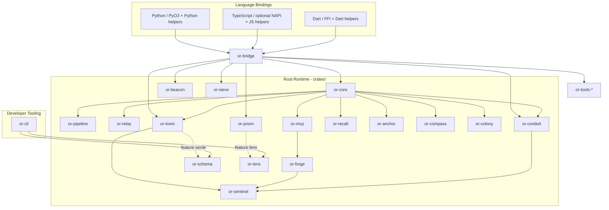

# Architecture Overview

Orchustr is a Rust-first workspace that layers shared contracts, execution runtimes, integrations, local tooling, and bindings instead of collapsing everything into a single crate. `or-core` anchors state and retry behavior, execution crates build on those primitives, `or-bridge` forms the native boundary for language bindings, and newer additive crates such as `or-schema`, `or-lens`, and `or-cli` extend flexibility and developer tooling without changing the older runtime surfaces.

## Bird's-Eye Diagram

## Layer Summary

- **Foundation**: `or-core` defines state, retry, token budgets, and in-memory persistence/vector contracts.
- **Execution**: `or-pipeline`, `or-relay`, `or-compass`, and `or-loom` cover sequential, parallel, predicate-routed, and graph execution.
- **Intelligence and integration**: `or-conduit`, `or-forge`, `or-mcp`, `or-sieve`, `or-recall`, and `or-anchor` add provider, tool, schema, memory, and retrieval capabilities.
- **Agent behavior**: `or-sentinel` and `or-colony` compose the lower layers into agent and multi-agent runtimes.
- **Descriptors and observability**: `or-schema` provides serializable graph descriptors, while `or-prism` and `or-lens` cover tracing bootstrap and local dashboard inspection.
- **Cross-language and tooling**: `or-bridge` owns the shared binding gateway, and `or-cli` provides scaffolding, linting, and local trace bootstrap commands.

## Known Gaps & Limitations

- The binding layer intentionally mixes native bridge calls with host-language helpers instead of mirroring every Rust item through raw FFI.
- Several crates intentionally stay in-memory or feature-gated rather than shipping production backends by default.
