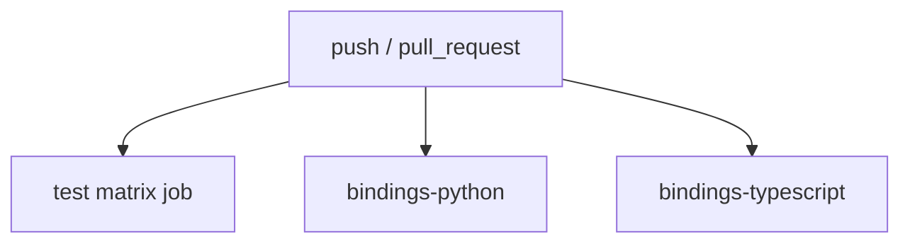

# GitHub Actions Workflow

## Workflow File

- Path: `.github/workflows/ci.yml`
- Triggers: `push`, `pull_request`

## Job Graph



## Line-by-Line Annotated Workflow

```yaml
# Name of the workflow as shown in GitHub Actions UI
name: CI

# Run on direct pushes and pull requests
on: [push, pull_request]

jobs:
  # Main Rust validation and coverage job
  test:
    strategy:
      matrix:
        os: [ubuntu-latest, macos-latest, windows-latest]   # Cross-platform validation
        rust: [1.87.0]                                      # Pinned toolchain version
    runs-on: ${{ matrix.os }}
    steps:
      - uses: actions/checkout@v4                           # Fetch repository contents
      - uses: dtolnay/rust-toolchain@master                 # Install requested Rust toolchain
        with: { toolchain: "${{ matrix.rust }}", components: "clippy,rustfmt" }
      - uses: taiki-e/install-action@cargo-nextest          # Install nextest test runner
      - uses: taiki-e/install-action@cargo-llvm-cov         # Install coverage tool
      - run: cargo fmt --all -- --check                     # Enforce formatting
      - run: cargo clippy --all-targets --all-features -- -D warnings  # Enforce lint cleanliness
      - run: cargo deny check                               # Enforce advisory and license policy
      - run: cargo nextest run --all-features               # Run Rust test suite
      - run: cargo llvm-cov --all-features --lcov --output-path lcov.info  # Produce LCOV coverage
      - uses: codecov/codecov-action@v4                    # Upload coverage report
        with: { files: lcov.info, fail_ci_if_error: true, threshold: 80 }

  # Python package build and tests
  bindings-python:
    runs-on: ubuntu-latest
    steps:
      - uses: actions/checkout@v4
      - uses: actions/setup-python@v5
        with: { python-version: "3.14.4" }                # CI Python version
      - run: pip install maturin pytest                     # Install build/test tooling
      - run: cd bindings/python && maturin develop         # Build/install extension into environment
      - run: cd bindings/python && pytest tests/           # Run Python tests

  # TypeScript package install, typecheck, and tests
  bindings-typescript:
    runs-on: ubuntu-latest
    steps:
      - uses: actions/checkout@v4
      - uses: actions/setup-node@v4
        with: { node-version: "20" }                      # CI Node version
      - run: cd bindings/typescript && npm ci && npm run typecheck && npm test
```

## Triggers

- `push`: runs on direct pushes to repository branches.
- `pull_request`: runs for pull request updates.

## Secrets and Environment Variables

- **Secrets referenced directly**: none in the workflow YAML.
- **Environment variables declared at workflow level**: none.
- **External service interaction**: Codecov upload is configured through the action step, but no explicit token is referenced in the checked-in YAML.

## Matrix Strategy

- OS matrix: Ubuntu, macOS, Windows for the main Rust job.
- Rust matrix: single version `1.87.0`.

## Cache Strategy

- No explicit `actions/cache` step is present.
- Tool install actions may use their own internal caching, but the workflow YAML does not declare repository-managed caches.

## Artifact and Deployment Notes

- Coverage output `lcov.info` is generated and uploaded to Codecov.
- No build artifacts are uploaded to GitHub Actions for download.
- No deployment or publishing targets are defined.

⚠️ Known Gaps & Limitations
- The workflow does not publish Rust crates, Python packages, or npm packages.
- Binding jobs are Linux-only, while the Rust matrix is cross-platform.
