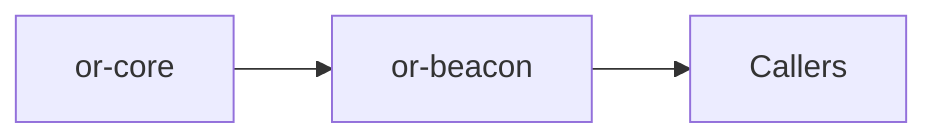

# or-beacon

**Status**: 🟢 Complete | **Version**: `0.1.0` | **Deps**: serde, serde_json, thiserror, tracing

Prompt templating crate with variable extraction, render-time validation, and control-character sanitization.

## Position in the Workspace

## Implementation Status

| Component | Status | Notes |
|---|---|---|
| Prompt templates | 🟢 | `PromptTemplate` captures the template and discovered variables. |
| Builder validation | 🟢 | `PromptBuilder` validates placeholder syntax before build. |
| Rendering | 🟢 | Context objects are serialized to JSON objects and sanitized before substitution. |

## Public Surface

- `PromptTemplate` (struct): Compiled prompt template with tracked variable names.
- `PromptBuilder` (struct): Builder for validating and constructing prompt templates.
- `PromptOrchestrator` (struct): Application helper for build and render operations.
- `BeaconError` (enum): Error type for malformed templates and invalid context objects.

## Dependencies

- Internal crates: or-core
- External crates: serde, serde_json, thiserror, tracing

⚠️ Known Gaps & Limitations
- Only `{{variable}}` placeholder substitution is implemented.
- There is no file-backed prompt registry or template version store in this crate.
