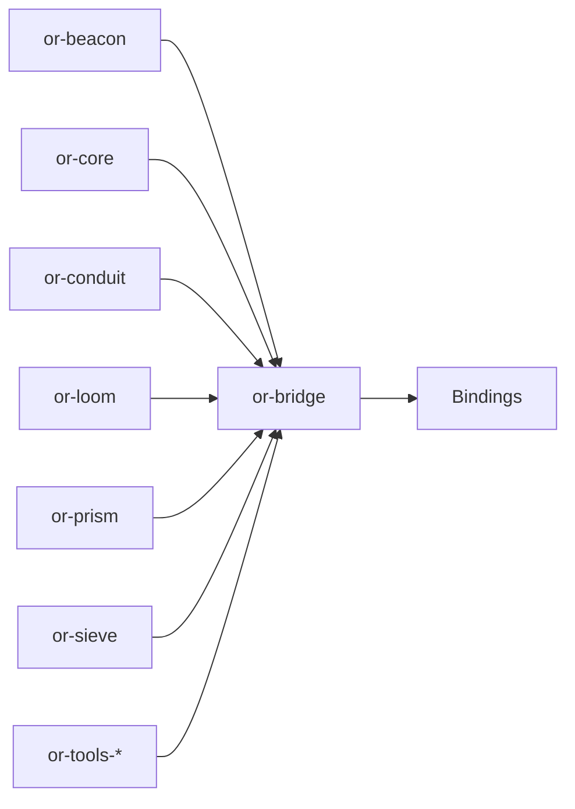

# or-bridge

**Status**: Partial | **Version**: `0.1.3` | **Deps**: serde, serde_json, thiserror, tracing, tokio, reqwest, pyo3(feature), napi(feature)

`or-bridge` is the workspace's native binding gateway. It keeps the cross-language ABI intentionally smaller than the full Rust crate graph while still exposing common prompt, state, catalog, and crate-invocation entry points.

## Position in the Workspace



## Implementation Status

| Component | Status | Notes |
|---|---|---|
| JSON bridge surface | Complete | Prompt rendering, state normalization, workspace catalog discovery, and crate invocation. The dispatch layer now lives in [`infra/facades/`](../../../crates/or-bridge/src/infra/facades/) — one file per tool surface. |
| Runtime adapter | Complete | `block_on` branches on `RuntimeFlavor`: it uses `block_in_place` on multi-thread runtimes and refuses (with a typed error) on current-thread runtimes instead of panicking. |
| Python native module | Complete | Feature-gated pyo3 classes for `PyGraphBuilder`, `PyDynState`, `PyNodeResult`, `PyPromptBuilder`, `PyPipelineBuilder`, `PyConduitProvider`, `PyForgeRegistry`, `PyColonyBuilder`, and `PyRelayBuilder`. All registries / builders now **retain** the Python callables they receive — `PyForgeRegistry::invoke` and `PyConduitProvider::complete_messages` actually call them; `PyExecutionGraph::get_handler` returns the registered callable. |
| Node native module | Implemented | NAPI exports remain available for the TypeScript native loader path. |
| Dart native module | Complete | C-ABI exports for `dart:ffi`. `into_raw_string` now distinguishes interior NUL from no-data via a typed error rather than silently returning null. |

## Public Surface

- `render_prompt_json` (fn): Renders a Beacon template using JSON object context.
- `normalize_state_json` (fn): Validates and normalizes a JSON object string for state exchange.
- `workspace_catalog_json` (fn): Returns a JSON catalog of crates surfaced through the binding layer.
- `invoke_crate_json` (fn): Invokes a supported crate operation using JSON input and output.
- `BridgeError` (enum): Error type for invalid JSON, invalid input, unsupported operations, and invocation failures.
- `python` (module, feature=`python`): Exposes additive PyO3 wrapper classes such as `PyGraphBuilder`, `PyDynState`, `PyNodeResult`, `PyPromptBuilder`, `PyPipelineBuilder`, `PyConduitProvider`, `PyForgeRegistry`, `PyColonyBuilder`, and `PyRelayBuilder`.

## Dependencies

- Internal crates: `or-beacon`, `or-conduit`, `or-core`, `or-loom`, `or-prism`, `or-sieve`, `or-tools-*`
- External crates: serde, serde_json, thiserror, tracing, tokio, reqwest, pyo3(feature), napi(feature)

## Building

`or-bridge` requires at least one of `dart`, `node`, or `python` features.
Workspace-level `cargo build` skips this crate; build it explicitly:

```bash
cargo build -p or-bridge                       # default = dart
cargo build -p or-bridge --features python     # pyo3 extension
cargo build -p or-bridge --features node       # napi-rs add-on
```

The `python` build needs a Python interpreter on `PATH`. If pyo3
cannot find one, set `PYO3_PYTHON=/path/to/python`.

## Known Gaps & Limitations

- The bridge exposes selected binding-safe entry points rather than a raw 1:1 export of every Rust item.
- Many higher-level workflows remain binding-local because driving Python/JS/Dart node handlers from the Rust executor would require a per-language async-callback bridge that doesn't yet exist (audit item #23).
