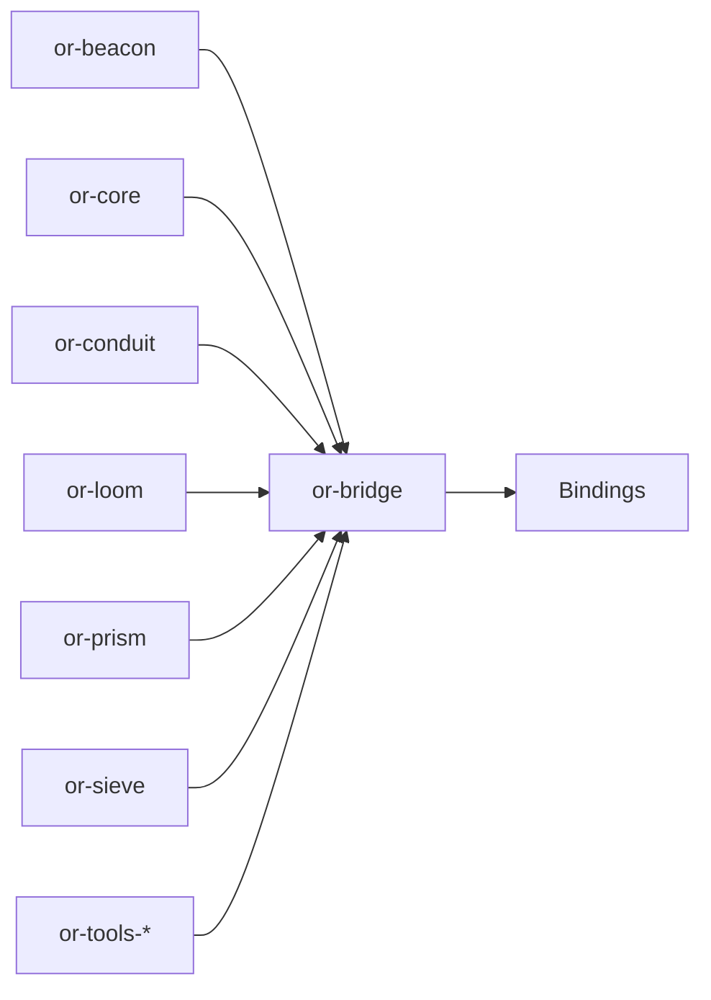

# or-bridge

**Status**: Partial | **Version**: `0.1.2` | **Deps**: serde, serde_json, thiserror, tracing, tokio, reqwest, pyo3(feature), napi(feature)

`or-bridge` is the workspace's native binding gateway. It keeps the cross-language ABI intentionally smaller than the full Rust crate graph while still exposing common prompt, state, catalog, and crate-invocation entry points.

## Position in the Workspace

## Implementation Status

| Component | Status | Notes |
|---|---|---|
| JSON bridge surface | Implemented | Prompt rendering, state normalization, workspace catalog discovery, and crate invocation are implemented. |
| Python native module | Partial | Feature-gated PyO3 classes now include additive wrappers for graph, prompt, pipeline, relay, colony, state, and node-result concepts. |
| Node native module | Implemented | NAPI exports remain available for the TypeScript native loader path. |
| Dart native module | Implemented | C-ABI exports remain available for `dart:ffi` loading. |

## Public Surface

- `render_prompt_json` (fn): Renders a Beacon template using JSON object context.
- `normalize_state_json` (fn): Validates and normalizes a JSON object string for state exchange.
- `workspace_catalog_json` (fn): Returns a JSON catalog of crates surfaced through the binding layer.
- `invoke_crate_json` (fn): Invokes a supported crate operation using JSON input and output.
- `BridgeError` (enum): Error type for invalid JSON, invalid input, unsupported operations, and invocation failures.
- `python` (module, feature=`python`): Exposes additive PyO3 wrapper classes such as `PyGraphBuilder`, `PyDynState`, `PyNodeResult`, `PyPromptBuilder`, `PyPipelineBuilder`, `PyConduitProvider`, `PyForgeRegistry`, `PyColonyBuilder`, and `PyRelayBuilder`.

## Dependencies

- Internal crates: `or-beacon`, `or-conduit`, `or-core`, `or-loom`, `or-prism`, `or-sieve`, `or-tools-*`
- External crates: serde, serde_json, thiserror, tracing, tokio, reqwest, pyo3(feature), napi(feature)

## Known Gaps & Limitations

- The bridge exposes selected binding-safe entry points rather than a raw 1:1 export of every Rust item.
- Many higher-level workflows remain binding-local on purpose because that produces a safer and more natural API in Python, TypeScript, and Dart.
