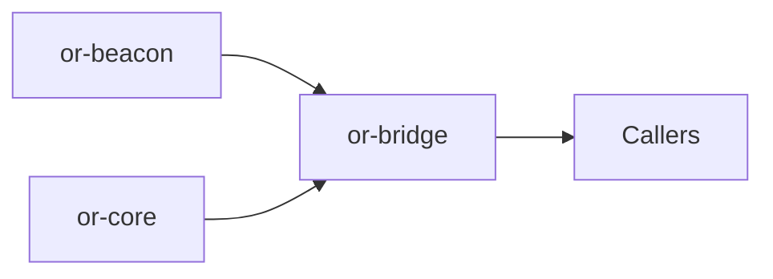

# or-bridge

**Status**: 🟡 Partial | **Version**: `0.1.1` | **Deps**: serde, serde_json, thiserror, tracing, pyo3 (feature), napi (feature)

Thin bridge crate that exposes a small Rust surface to Python and Node consumers for prompt rendering and state normalization.

## Position in the Workspace

## Implementation Status

| Component | Status | Notes |
|---|---|---|
| Rust bridge surface | 🟢 | `render_prompt_json` and `normalize_state_json` are implemented and tested. |
| Python bridge | 🟡 | PyO3 bindings expose only the narrow helper surface, not the full workspace API. |
| Node bridge | 🟡 | NAPI exports mirror the same helpers and are not yet consumed by the TypeScript package. |

## Public Surface

- `render_prompt_json` (fn): Renders a Beacon template using JSON object context.
- `normalize_state_json` (fn): Validates and normalizes a JSON object string for state exchange.
- `BridgeError` (enum): Error type for invalid state JSON and prompt rendering failures.
- `BridgeState` (struct): Wrapper for JSON payloads crossing the binding boundary.

## Dependencies

- Internal crates: or-beacon, or-core
- External crates: serde, serde_json, thiserror, tracing, pyo3 (feature), napi (feature)

## FFI and Safety

- Python bindings are gated behind the `python` feature and use PyO3 macros in `src/python.rs`.
- Node bindings are gated behind the `node` feature and use NAPI macros in `src/node.rs`.
- No `unsafe` blocks were found in this crate during source review.

⚠️ Known Gaps & Limitations
- The bridge exposes only prompt rendering and state normalization today.
- No unsafe blocks are present, but the Node package does not yet load the NAPI build.
