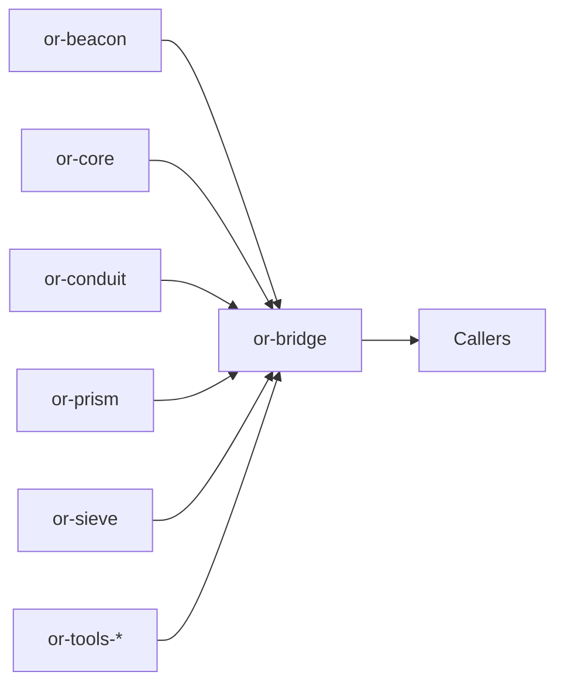

# or-bridge

**Status**: Partial | **Version**: `0.1.2` | **Deps**: serde, serde_json, thiserror, tracing, pyo3 (feature), napi (feature), tokio, reqwest

`or-bridge` is the workspace's native binding gateway. It gives Python, Node, and Dart a shared JSON-oriented entry point into Rust-backed functionality while keeping the cross-language ABI narrower than the full internal crate graph.

## Position in the Workspace

## Implementation Status

| Component | Status | Notes |
|---|---|---|
| Rust bridge surface | Implemented | Prompt/state helpers, workspace catalog discovery, and crate invocation are implemented. |
| Python bridge | Implemented | PyO3 bindings expose the shared bridge surface used by `RustCrateBridge`. |
| Node bridge | Implemented | NAPI exports are available and can be consumed through the TypeScript native loader. |
| Dart bridge | Implemented | C-ABI exports are available for `dart:ffi` loading. |

## Public Surface

- `render_prompt_json` (fn): Renders a Beacon template using JSON object context.
- `normalize_state_json` (fn): Validates and normalizes a JSON object string for state exchange.
- `workspace_catalog_json` (fn): Returns a JSON catalog of workspace crates exposed through the binding layer.
- `invoke_crate_json` (fn): Invokes a supported crate operation using JSON input and output.
- `BridgeError` (enum): Error type for invalid JSON, invalid input, unsupported operations, and invocation failures.
- `BridgeState` (struct): Wrapper for JSON payloads crossing the binding boundary.

## Dependencies

- Internal crates: or-beacon, or-conduit, or-core, or-prism, or-sieve, `or-tools-*`
- External crates: serde, serde_json, thiserror, tracing, tokio, reqwest, pyo3 (feature), napi (feature)

## FFI and Safety

- Python bindings are gated behind the `python` feature and use PyO3 macros in `src/python.rs`.
- Node bindings are gated behind the `node` feature and use NAPI macros in `src/node.rs`.
- Dart bindings are gated behind the `dart` feature and use C-ABI exports in `src/dart.rs`.
- The bridge surface is JSON-oriented, which keeps cross-language memory ownership simpler and easier to validate.
- No `unsafe` blocks were found in this crate during source review.

⚠️ Known Gaps & Limitations

- The bridge exposes supported crate operations rather than a raw 1:1 export of every Rust item.
- Some workspace crates are intentionally surfaced through binding-local workflow helpers instead of direct FFI because that produces a safer and more natural API.
