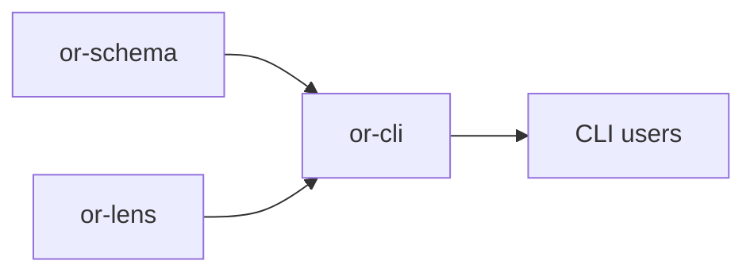

# or-cli

**Status**: Partial | **Version**: `0.1.2` | **Deps**: clap, serde, serde_yaml, thiserror, tokio

Command-line scaffolding and validation crate for Orchustr projects.

## Position in the Workspace

## Implementation Status

| Component | Status | Notes |
|---|---|---|
| Project scaffolding | Complete | `orchustr init` generates Rust, Python, TypeScript, and Dart starter files plus `orchustr.yaml`. |
| Graph linting | Complete | `orchustr lint` validates graph descriptors and project config references offline. |
| Trace bootstrap | Partial | `orchustr trace` verifies the dashboard port and boot path by starting and stopping `or-lens`. |
| Project run hook | Partial | `run_project` parses config and graph descriptors, then hands them to a `ProjectRunner`; the default runner is intentionally a no-op scaffold hook. |

## Commands

- `orchustr init <project-name> [--lang ...] [--topology ...] [--provider ...]`
- `orchustr run <project-dir>`
- `orchustr lint <project-dir>`
- `orchustr trace <project-dir>`
- `orchustr new node <name>`
- `orchustr new topology <name>`

## Public Surface

- `InitOptions`, `ProjectLanguage`, `TopologyKind`, `ProviderKind`
- `ProjectRunner`, `DefaultProjectRunner`
- `init_project`, `lint_path`, `run_project`, `trace_project`
- `scaffold_node`, `scaffold_topology`
- `CliError`

## Known Gaps & Limitations

- `run_project` currently validates and hands off parsed project state; it does not yet execute language-specific node handlers on its own.
- Template rendering is intentionally simple and does not yet support user-defined template packs.
