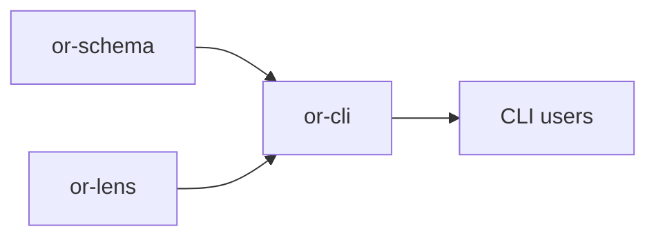

# or-cli

**Status**: Partial | **Version**: `0.1.3` | **Deps**: clap, serde, serde_yaml, thiserror, tokio

Command-line scaffolding and validation crate for Orchustr projects.

## Position in the Workspace

## Implementation Status

| Component | Status | Notes |
|---|---|---|
| Project scaffolding | Complete | `orchustr init` generates Rust, Python, TypeScript, and Dart starter files plus `orchustr.yaml`. |
| Graph linting | Complete | `orchustr lint` validates graph descriptors and project config references offline and prints each validated path. |
| Trace dashboard | Complete | `orchustr trace` starts the local `or-lens` dashboard, prints the bound port, and stays running until Ctrl-C. |
| Project run | Complete | `DefaultProjectRunner` shells out to the language toolchain declared in `orchustr.yaml` (`cargo run` / `python` / `npm start` or `npx tsx` / `dart run`) with inherited stdio and `kill_on_drop`. |
| Error rendering | Complete | The `orchustr` binary renders `CliError` via `Display` (`orchustr: <message>`) instead of the previous `Debug`-printed struct. |

## Commands

- `orchustr init <project-name> [--lang ...] [--topology ...] [--provider ...]`
- `orchustr run <project-dir>`
- `orchustr lint <project-dir>`
- `orchustr trace <project-dir>`
- `orchustr new node <name>`
- `orchustr new topology <name>`

## Public Surface

- `InitOptions`, `ProjectLanguage`, `TopologyKind`, `ProviderKind`
- `ProjectRunner`, `DefaultProjectRunner`
- `init_project`, `lint_path`, `run_project`, `trace_project`
- `scaffold_node`, `scaffold_topology`
- `CliError`

## Known Gaps & Limitations

- `DefaultProjectRunner` shells out to the language toolchain — it does not host node handlers in-process. A "host the graph executor in Rust and call host-language nodes via FFI callbacks" path is not yet wired (audit item #23).
- Template rendering is intentionally simple and does not yet support user-defined template packs.
