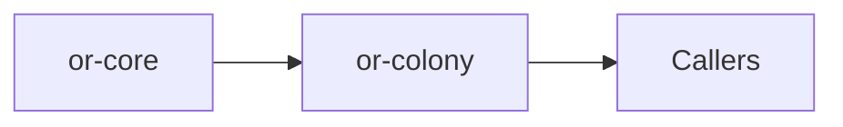

# or-colony

**Status**: 🟡 Partial | **Version**: `0.1.0` | **Deps**: serde, serde_json, thiserror, tracing

Multi-agent coordination crate that sequences member responses, shares a transcript, and aggregates outputs into final colony state.

## Position in the Workspace

## Implementation Status

| Component | Status | Notes |
|---|---|---|
| Agent contract | 🟢 | `ColonyAgentTrait` defines the async response interface for individual members. |
| Coordination runtime | 🟡 | `ColonyOrchestrator` coordinates members sequentially and records outputs. |
| Aggregation | 🟢 | Message and summary aggregation are implemented in adapter helpers. |

## Public Surface

- `ColonyAgentTrait` (trait): Async interface implemented by a colony member runtime.
- `ColonyMember` (struct): Metadata describing a named colony participant and role.
- `ColonyMessage` (struct): Represents a message in the multi-agent transcript.
- `ColonyResult` (struct): Aggregated outcome containing final state, messages, and summary.
- `ColonyOrchestrator` (struct): Application entry point for member registration and coordination.
- `ColonyError` (enum): Error type for duplicate members, empty rosters, and malformed state.

## Dependencies

- Internal crates: or-core
- External crates: serde, serde_json, thiserror, tracing

⚠️ Known Gaps & Limitations
- Execution is sequential rather than concurrent.
- The initial state contract currently requires a `task` field.
