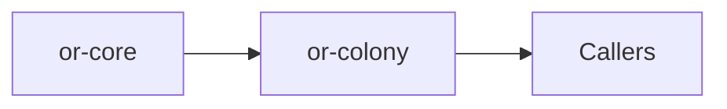

# or-colony

**Status**: 🟢 Complete | **Version**: `0.1.3` | **Deps**: futures, serde, serde_json, thiserror, tracing

Multi-agent coordination crate. Members run either sequentially as a
cascading hand-off or in parallel as a fan-out, depending on which
orchestrator entry point you call.

## Position in the Workspace

## Implementation Status

| Component | Status | Notes |
|---|---|---|
| Agent contract | 🟢 | `ColonyAgentTrait` defines the async response interface for individual members. |
| Sequential cascade | 🟢 | `ColonyOrchestrator::coordinate` threads each member's reply into the next member's transcript. Use this for Researcher → Writer → Editor flows. |
| Parallel fan-out | 🟢 | `ColonyOrchestrator::coordinate_parallel` polls all members concurrently with `futures::try_join_all`. Each sees only the seed transcript; replies are merged in deterministic roster order. Use this for "ask three reviewers in parallel" flows. |
| Aggregation | 🟢 | Message and summary aggregation are implemented in adapter helpers. |

## Public Surface

- `ColonyAgentTrait` (trait): Async interface implemented by a colony member runtime.
- `ColonyMember` (struct): Metadata describing a named colony participant and role.
- `ColonyMessage` (struct): Represents a message in the multi-agent transcript.
- `ColonyResult` (struct): Aggregated outcome containing final state, messages, and summary.
- `ColonyOrchestrator` (struct): Application entry point for member registration and coordination.
- `ColonyError` (enum): Error type for duplicate members, empty rosters, and malformed state.

## Dependencies

- Internal crates: or-core
- External crates: futures, serde, serde_json, thiserror, tracing

⚠️ Known Gaps & Limitations
- The initial state contract currently requires a `task` field.
- `coordinate_parallel` short-circuits on the first member error; for
  best-effort fan-out (collect all replies even when some fail) callers
  should currently catch errors inside their `ColonyAgentTrait::respond`
  implementation rather than letting them propagate.
