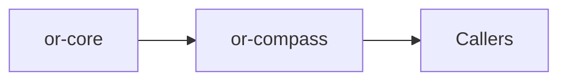

# or-compass

**Status**: 🟢 Complete | **Version**: `0.1.1` | **Deps**: serde, thiserror, tracing

Conditional routing crate that evaluates ordered predicates against state and selects a named route.

## Position in the Workspace

## Implementation Status

| Component | Status | Notes |
|---|---|---|
| Builder validation | 🟢 | Route names and defaults are validated at build time. |
| Predicate routing | 🟢 | Routes are evaluated in registration order. |
| Application wrapper | 🟢 | `CompassOrchestrator` wraps route selection with tracing. |

## Public Surface

- `RouteSelection` (struct): Represents the chosen route name after evaluation.
- `CompassRouterBuilder` (struct): Builder for registering route predicates and a default route.
- `CompassRouter` (struct): Concrete runtime that evaluates predicates against state.
- `CompassOrchestrator` (struct): Thin wrapper around route selection with tracing.
- `CompassError` (enum): Error type for router construction and evaluation failures.

⚠️ Known Gaps & Limitations
- Predicates are executable closures, so router instances are not serializable.
