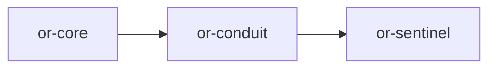

# or-conduit

**Status**: 🟢 Complete | **Version**: `0.1.1` | **Deps**: futures, reqwest, serde, serde_json, thiserror, tokio, tracing

Provider abstraction for text and multimodal completions. Supports 22 LLM providers and aggregators with retry, token-budget enforcement, configurable timeouts, and key redaction.

## Position in the Workspace



## Implementation Status

| Component | Status | Notes |
|---|---|---|
| Message model | 🟢 | Structured multimodal messages and responses are implemented. |
| Provider adapters | 🟢 | 22 providers: OpenAI, OpenRouter, Anthropic, Gemini, Cohere, AI21, HuggingFace, Replicate, Azure, Bedrock, Vertex, Together, Groq, Fireworks, DeepSeek, Mistral, xAI, Nvidia, Ollama. |
| Streaming | 🟡 | Default implementation chunks final text locally. Provider-native SSE not yet implemented. |
| Security | 🟢 | API keys redacted in Debug, auth failure returns Result, configurable timeouts. |

## Public Surface

### Core Types
- `ConduitProvider` (trait): Async provider abstraction for message completion and streaming.
- `CompletionMessage` (struct): Role-tagged message with multimodal content parts.
- `ContentPart` (enum): Represents text, image, or document content within a message.
- `CompletionResponse` (struct): Returned completion text, token usage, and finish reason.
- `ConduitOrchestrator` (struct): Application helper for preparing and executing completion requests.
- `ConduitError` (enum): Error type for missing env vars, HTTP failures, budgets, timeouts, and auth failures.

### Provider Conduits

| Type | Provider(s) |
|---|---|
| `OpenAiCompatConduit` | OpenAI, OpenRouter, Together, Groq, Fireworks, DeepSeek, Mistral, xAI, Nvidia, Ollama |
| `AnthropicConduit` | Anthropic (Claude) |
| `GeminiConduit` | Google Gemini |
| `CohereConduit` | Cohere (Command) |
| `AI21Conduit` | AI21 Labs (Jamba) |
| `HuggingFaceConduit` | Hugging Face Inference API |
| `ReplicateConduit` | Replicate |
| `AzureConduit` | Azure OpenAI Service |
| `BedrockConduit` | AWS Bedrock |
| `VertexConduit` | Google Vertex AI |

## Directory Structure

```
src/
├── domain/
│   ├── contracts.rs     # ConduitProvider trait
│   ├── entities.rs      # CompletionMessage, CompletionResponse, etc.
│   └── errors.rs        # ConduitError
├── application/
│   └── orchestrators.rs # ConduitOrchestrator
└── infra/
    ├── http.rs          # Shared HTTP execution, retry, timeout, auth
    ├── adapters/        # Payload/response shaping per provider
    │   ├── openai_compat.rs
    │   ├── anthropic.rs
    │   ├── gemini.rs
    │   ├── cohere.rs
    │   ├── ai21.rs
    │   ├── huggingface.rs
    │   ├── replicate.rs
    │   ├── bedrock.rs
    │   └── vertex.rs
    └── implementations/  # Provider conduit structs
        ├── openai_compat.rs  # 10 providers via factory constructors
        ├── anthropic.rs
        ├── gemini.rs
        ├── cohere.rs
        ├── ai21.rs
        ├── huggingface.rs
        ├── replicate.rs
        ├── azure.rs
        ├── bedrock.rs
        └── vertex.rs
```

## Provider Usage

See the full [LLM Providers Guide](../guides/llm-providers.md) for examples and environment variables.

### Quick Start

```rust
use or_conduit::{OpenAiCompatConduit, ConduitProvider, CompletionMessage, MessageRole};

let provider = OpenAiCompatConduit::openai_from_env()?;
let response = provider.complete_text("Hello, world!").await?;
println!("{}", response.text);
```

## Security Features

- **Key redaction**: All `Debug` implementations print `[REDACTED]` instead of raw API keys.
- **Auth guard**: `bearer_headers()` returns `Err(AuthenticationFailed)` on empty/missing keys.
- **Timeout**: Configurable HTTP timeout (default 30s) with `ConduitError::Timeout`.
- **Budget enforcement**: Token budget checked before request dispatch.
