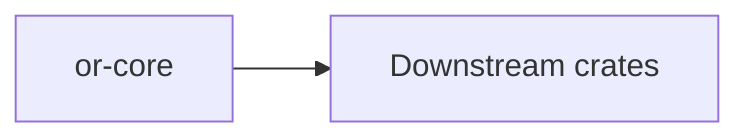

# or-core

**Status**: 🟢 Complete | **Version**: `0.1.1` | **Deps**: rand, serde, serde_json, thiserror, tokio, tracing

Shared state contracts, retry and token budget types, and in-memory persistence/vector primitives that most other crates build on.

## Position in the Workspace

## Implementation Status

| Component | Status | Notes |
|---|---|---|
| State contracts | 🟢 | `OrchState`, `DynState`, `PersistenceBackend`, and `VectorStore` are implemented. |
| Budget and retry utilities | 🟢 | `TokenBudget`, `RetryPolicy`, and `BackoffStrategy` are present and tested. |
| In-memory infrastructure | 🟢 | HashMap-backed persistence and cosine-similarity vector storage are implemented. |

## Public Surface

- `DynState` (type alias): Schemaless state map used at graph, agent, and binding boundaries.
- `OrchState` (trait): Core state trait with clone, serde, and merge semantics.
- `PersistenceBackend` (trait): Async key/value persistence contract.
- `VectorStore` (trait): Async vector index contract.
- `TokenBudget` (struct): Represents context and completion token limits.
- `RetryPolicy` (struct): Holds retry attempt and delay parameters.
- `BackoffStrategy` (enum): Calculates retry delays.
- `CoreOrchestrator` (struct): Wraps budget checks and retry delay planning with tracing.
- `InMemoryPersistenceBackend` (struct): In-memory `PersistenceBackend` implementation.
- `InMemoryVectorStore` (struct): In-memory cosine-similarity vector store.

## Dependencies

- Internal crates: `(none)`
- External crates: rand, serde, serde_json, thiserror, tokio, tracing

⚠️ Known Gaps & Limitations
- Persistence and vector storage in this crate are in-memory only.
- Downstream crates add optional durable backends rather than `or-core` itself.
