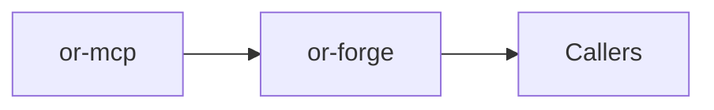

# or-forge

**Status**: 🟡 Partial | **Version**: `0.1.0` | **Deps**: schemars, serde, serde_json, thiserror, tracing

Async tool registry for local Rust tools and imported MCP tools, with JSON Schema validation at invocation time.

## Position in the Workspace

## Implementation Status

| Component | Status | Notes |
|---|---|---|
| Tool metadata | 🟢 | `ForgeTool` captures tool name, description, and input schema. |
| Registry runtime | 🟢 | Local handlers and MCP proxies can both be registered and invoked asynchronously. |
| Schema validation | 🟡 | Validation covers the schema patterns used in this repository, not every JSON Schema feature. |

## Public Surface

- `ForgeTool` (struct): Named tool definition with description and input schema.
- `ForgeRegistry` (struct): Registry for local async handlers and imported MCP tool proxies.
- `ForgeError` (enum): Error type for duplicate tools, invalid arguments, and invocation failures.

⚠️ Known Gaps & Limitations
- Schema validation is intentionally lightweight rather than exhaustive JSON Schema support.
- There is no derive macro or declarative registration layer in the current implementation.
