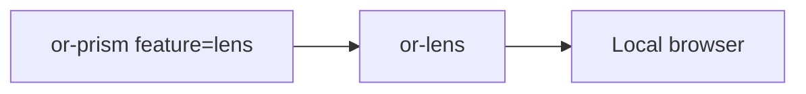

# or-lens

**Status**: Partial | **Version**: `0.1.3` | **Deps**: axum(feature=`dashboard`), dashmap(feature=`dashboard`), reqwest(feature=`dashboard`), serde(feature=`dashboard`), serde_json(feature=`dashboard`), tokio(feature=`dashboard`), tracing(feature=`dashboard`)

`or-lens` is the optional local execution dashboard for Orchustr. It serves an embedded HTML UI, stores recent traces in memory, and exposes serialized execution snapshots for local debugging.

## Position in the Workspace

## Implementation Status

| Component | Status | Notes |
|---|---|---|
| Dashboard server | Complete | Axum server serves `/`, `/api/traces`, and `/api/traces/{id}`. |
| Trace storage | Complete | `SpanCollector` stores traces in memory, bounded by `spans_per_trace` (default 10 000) and `max_traces` (default 1 024). When either cap is exceeded the oldest spans / least-recently-active traces are evicted. Use `SpanCollector::with_capacity` to tune. |
| Snapshot rendering | Complete | Collected spans are converted into `ExecutionSnapshot` values. |
| Transport breadth | Partial | The current implementation is in-process and layer-driven rather than a standalone OTLP receiver. |

## Public Surface

- `LensHandle` (struct): Handle returned when the local dashboard server starts.
- `LensLayer` (struct): Tracing layer that mirrors completed spans into a repository.
- `SpanCollector` (struct): In-memory trace repository and collector implementation.
- `LensSpan` / `LensSpanStatus` / `TraceSummary` (types): Serializable trace records and summaries.
- `ExecutionSnapshot` / `ExecutionNodeSnapshot` (types): Serializable dashboard snapshot output.
- `start_dashboard_server` (fn): Starts the dashboard with a fresh collector.
- `LensError` (enum): Error type for bind and serve failures.

## Known Gaps & Limitations

- `or-lens` is feature-gated behind `dashboard`.
- The current implementation is a local developer tool, not a production telemetry backend.
