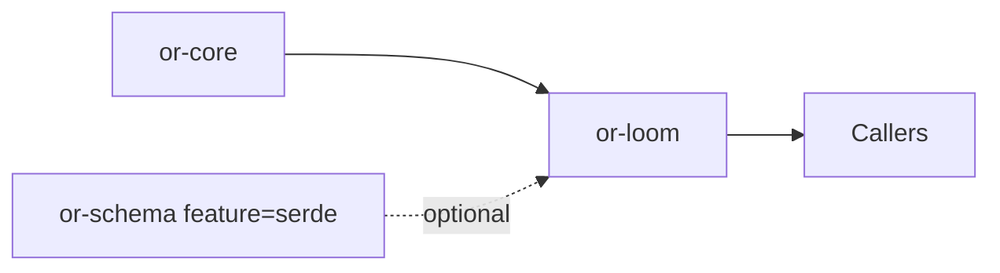

# or-loom

**Status**: Complete | **Version**: `0.1.2` | **Deps**: serde, thiserror, tracing

`or-loom` is the directed execution graph runtime for Orchustr. It builds executable state graphs with explicit entry and exit nodes, branch-aware node results, pause semantics, and optional descriptor compilation through `NodeRegistry`.

## Position in the Workspace

## Implementation Status

| Component | Status | Notes |
|---|---|---|
| Graph builder | Complete | Nodes, edges, entry, and exit nodes are validated before runtime construction. |
| Execution runtime | Complete | Graphs execute sequentially with explicit branching, pausing, and step-limit enforcement. |
| Graph inspection | Complete | `ExecutionGraph::inspect()` exposes node and edge structure for parity and topology tests. |
| Schema compilation | Complete | `NodeRegistry` compiles `or-schema::GraphSpec` values when the `serde` feature is enabled. |

## Public Surface

- `NodeResult` (enum): Represents how a node advances execution: advance, branch, or pause.
- `GraphBuilder` (struct): Builder for graph nodes, edges, entry, and exit configuration.
- `ExecutionGraph` (struct): Executable state graph produced by `GraphBuilder::build`.
- `GraphInspection` and `GraphEdgeInspection` (structs): Structural inspection helpers used by higher-level crates and tests.
- `LoomOrchestrator` (struct): Application helper for executing graphs with tracing.
- `LoomError` (enum): Error type for graph validation, execution, and schema-resolution issues.
- `NodeRegistry` (struct, feature=`serde`): Resolves named handlers and conditional predicates from `GraphSpec` descriptors.

## Known Gaps & Limitations

- Schema compilation is intentionally feature-gated so the base crate can still compile without `or-schema`.
- Execution remains sequential by design; concurrency is modeled in sibling crates such as `or-relay`.
