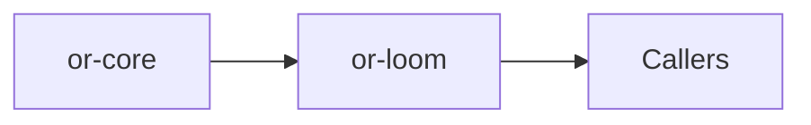

# or-loom

**Status**: 🟢 Complete | **Version**: `0.1.1` | **Deps**: serde, thiserror, tracing

Directed execution graph runtime with explicit entry and exit nodes, branch-aware node results, and pause semantics for checkpoint integration.

## Position in the Workspace

## Implementation Status

| Component | Status | Notes |
|---|---|---|
| Graph builder | 🟢 | Nodes, edges, entry, and exit are validated before runtime construction. |
| Execution runtime | 🟢 | Graphs execute sequentially with explicit branching, pausing, and step-limit enforcement. |
| Application wrapper | 🟢 | `LoomOrchestrator` wraps graph execution with tracing. |

## Public Surface

- `NodeResult` (enum): Represents how a node advances execution: advance, branch, or pause.
- `GraphBuilder` (struct): Builder for graph nodes, edges, entry, and exit configuration.
- `ExecutionGraph` (struct): Executable state graph produced by `GraphBuilder::build`.
- `LoomOrchestrator` (struct): Application helper for executing graphs with tracing.
- `LoomError` (enum): Error type for graph validation, execution, and pause/branch issues.

⚠️ Known Gaps & Limitations
- Node futures are intentionally not required to be `Send`, which keeps sequential execution flexible but limits some multi-thread assumptions.
