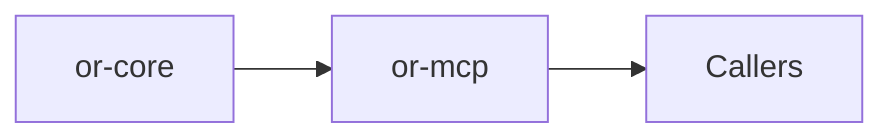

# or-mcp

**Status**: 🟡 Partial | **Version**: `0.1.1` | **Deps**: reqwest, schemars, serde, serde_json, thiserror, tokio, tracing

Model Context Protocol crate implementing JSON-RPC message types, streamable HTTP and stdio transports, and transport-driven client/server orchestration.

## Position in the Workspace

## Implementation Status

| Component | Status | Notes |
|---|---|---|
| Protocol model | 🟢 | JSON-RPC and MCP entities are implemented and re-exported. |
| Transports | 🟢 | Streamable HTTP and stdio transports are implemented and tested through scripted transports. |
| Server runtime | 🟡 | The crate handles requests over a transport, but it does not yet host a standalone HTTP listener of its own. |

## Public Surface

- `NexusClient` (struct): Transport-parameterized MCP client with HTTP and stdio constructors.
- `NexusServer` (struct): Transport-driven MCP server runtime for tool registration and request handling.
- `NexusClientTrait` (trait): Transport-agnostic client contract for sending requests and invoking tools.
- `NexusServerTrait` (trait): Transport-agnostic server contract for registering tools and serving.
- `McpTransport` (trait): Abstract send/receive transport used by client and server runtimes.
- `StreamableHttpTransport` (struct): Reqwest-backed transport for MCP over streamable HTTP.
- `StdioTransport` (struct): Subprocess-backed stdio transport for local MCP hosts.
- `JsonRpcOrchestrator` (struct): Small wrapper around JSON-RPC encoding and decoding helpers.
- `McpTool / McpTask / ServerCard` (structs): Primary MCP domain entities exposed by the crate.
- `McpError` (enum): Error type for protocol, transport, auth, task, and tool-execution failures.

## MCP Coverage

- Client constructors exist for streamable HTTP and stdio transports.
- Server request handling covers `initialize`, `ping`, `tools/list`, `tools/call`, `tasks/get`, and `shutdown`.
- Server Cards are exposed through `server_card_json()` and `server_card_path()`, not through a built-in HTTP listener.

⚠️ Known Gaps & Limitations
- The server runtime is transport-driven and does not yet expose its own standalone HTTP listener.
- OAuth token issuance or full auth flows are not implemented inside this crate.
