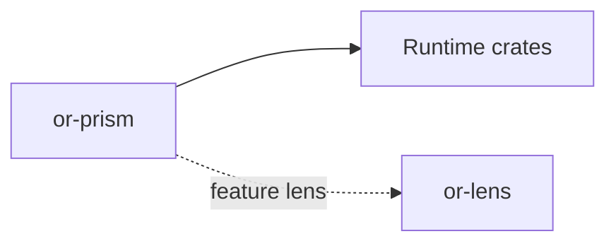

# or-prism

**Status**: Partial | **Version**: `0.1.3` | **Deps**: opentelemetry, opentelemetry-otlp, opentelemetry_sdk, reqwest, serde, thiserror, tokio, tracing, tracing-opentelemetry, tracing-subscriber

`or-prism` is the observability bootstrap crate for Orchustr. It installs a tracing subscriber with OTLP export, JSON log formatting, and environment-driven filtering. With the optional `lens` feature enabled, it can also start the local `or-lens` dashboard.

## Position in the Workspace

## Implementation Status

| Component | Status | Notes |
|---|---|---|
| Configuration | Complete | `PrismConfig` validates OTLP endpoints and defaults a service name. |
| Subscriber install | Complete | The crate installs tracing subscribers with OTLP span export and JSON formatting. |
| Local dashboard bridge | Partial | `init_with_dashboard` starts `or-lens` and mirrors spans into its in-process collector when feature `lens` is enabled. |
| Metrics breadth | Partial | The surface is currently focused on tracing bootstrap rather than a larger observability abstraction. |

## Public Surface

- `PrismConfig` (struct): Configuration for OTLP endpoint and service name.
- `install_global_subscriber` (fn): Installs the global tracing subscriber and OTLP exporter.
- `init_with_dashboard` (fn, feature=`lens`): Starts the local dashboard and installs the trace mirroring layer.
- `PrismError` (enum): Error type for invalid endpoints, exporter failures, dashboard bootstrap failures, and subscriber installation failures.

## Known Gaps & Limitations

- The crate focuses on tracing bootstrap and does not yet expose metrics-specific orchestration APIs.
- The local dashboard integration is additive and in-process; it is not a standalone telemetry backend.
