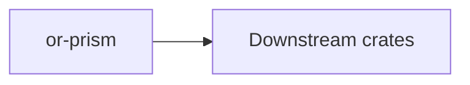

# or-prism

**Status**: 🟡 Partial | **Version**: `0.1.0` | **Deps**: opentelemetry, opentelemetry-otlp, opentelemetry_sdk, reqwest, serde, thiserror, tokio, tracing, tracing-opentelemetry, tracing-subscriber

Observability bootstrap crate that installs a tracing subscriber with OTLP export, JSON logs, and environment-driven filtering.

## Position in the Workspace

## Implementation Status

| Component | Status | Notes |
|---|---|---|
| Configuration | 🟢 | `PrismConfig` validates OTLP endpoints and defaults a service name. |
| Subscriber install | 🟢 | The crate installs tracing subscribers with OTLP span export and JSON formatting. |
| Metrics breadth | 🟡 | The surface is currently focused on tracing bootstrap rather than a larger observability abstraction. |

## Public Surface

- `PrismConfig` (struct): Configuration for OTLP endpoint and service name.
- `install_global_subscriber` (fn): Installs the global tracing subscriber and OTLP exporter.
- `PrismError` (enum): Error type for invalid endpoints, exporter failures, and subscriber installation failures.

## Position Relative to `or-sieve`

- `or-prism` handles observability bootstrap only.
- `or-sieve` handles output parsing and schema validation.
- The names are adjacent alphabetically, but the responsibilities are separate in code and dependency structure.

## Transformation Flow

- Input: OTLP endpoint string.
- Validation: endpoint parsing and config normalization.
- Output: installed tracing subscriber plus OTLP exporter.
- Supported output formats: JSON logs and exported tracing spans.
- Integration: runtime crates such as `or-pipeline` emit `tracing` spans that `or-prism` can export once installed.

⚠️ Known Gaps & Limitations
- The crate focuses on tracing bootstrap and does not yet expose metrics-specific orchestration APIs.
- It is unrelated to `or-sieve`; the similar short name reflects observability rather than output parsing.
