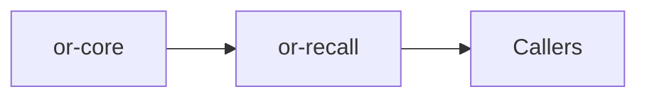

# or-recall

**Status**: 🟡 Partial | **Version**: `0.1.0` | **Deps**: serde, serde_json, thiserror, tokio, tracing, sqlx (feature)

Memory store crate for short-term, long-term, and episodic recall with in-memory and optional SQLite-backed implementations.

## Position in the Workspace

## Implementation Status

| Component | Status | Notes |
|---|---|---|
| Memory model | 🟢 | `RecallEntry` and `MemoryKind` are fully implemented and serializable. |
| Store contract | 🟢 | `RecallStore` defines async store and list operations. |
| Persistence backends | 🟡 | In-memory storage is always available; SQLite is feature-gated and optional. |

## Public Surface

- `MemoryKind` (enum): Categorizes recall entries as short-term, long-term, or episodic.
- `RecallEntry` (struct): Serializable memory record with metadata.
- `RecallStore` (trait): Async storage and listing contract for memory backends.
- `InMemoryRecallStore` (struct): Synchronized in-memory memory store.
- `SqliteRecallStore` (struct): Feature-gated SQLite-backed memory store.
- `RecallOrchestrator` (struct): Application helper for remember and recall operations.
- `RecallError` (enum): Error type for storage and serialization failures.

⚠️ Known Gaps & Limitations
- SQLite support is feature-gated and not the default runtime path.
- There is no vector-memory or retrieval scoring layer in this crate today.
