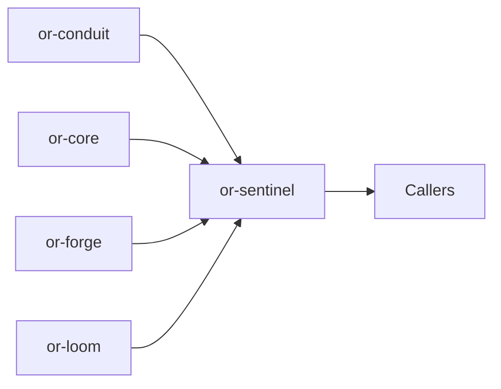

# or-sentinel

**Status**: 🟡 Partial | **Version**: `0.1.0` | **Deps**: serde, serde_json, thiserror, tokio, tracing

Agent runtime crate that implements an explicit think-act loop on top of graphs, provider completions, tool invocation, and typed dynamic state.

## Position in the Workspace

## Implementation Status

| Component | Status | Notes |
|---|---|---|
| ReAct-style runtime | 🟢 | `SentinelAgent` uses an internal `ExecutionGraph` to model think, act, and exit nodes. |
| Plan-and-execute runtime | 🟡 | `PlanExecuteAgent` is implemented but relies on simple JSON plan extraction from model output. |
| State and parsing helpers | 🟢 | Adapter helpers manage internal state keys, config injection, and tool observations. |

## Public Surface

- `StepOutcome` (enum): Outcome of a single agent step or full run.
- `SentinelConfig` (struct): Configuration for max steps, token budget, and tool retry policy.
- `PlanStep` (struct): Single step in the plan-and-execute flow.
- `SentinelAgentTrait` (trait): Async contract for running or stepping a sentinel agent.
- `PlanExecuteAgentTrait` (trait): Async contract for plan creation and plan execution.
- `SentinelAgent` (struct): Graph-backed think-act agent runtime over a provider and forge registry.
- `PlanExecuteAgent` (struct): Higher-level planner that delegates individual steps to a sentinel worker.
- `SentinelOrchestrator` (struct): Application helper for agent setup and top-level execution.
- `SentinelError` (enum): Error type for malformed state, provider/tool failures, and serialization issues.

## Runtime Shape

- `SentinelAgent::new(provider, registry)` builds an internal graph with `think`, `act`, and `exit` nodes.
- State is carried as `DynState` and must contain `messages` for agent execution.
- Tool results are written back into message history as `MessageRole::Tool` observations.

⚠️ Known Gaps & Limitations
- Decision and plan parsing depend on expected JSON-ish model output rather than provider-enforced structured mode.
- The internal graph always uses the fixed think/act/exit topology in the current implementation.
