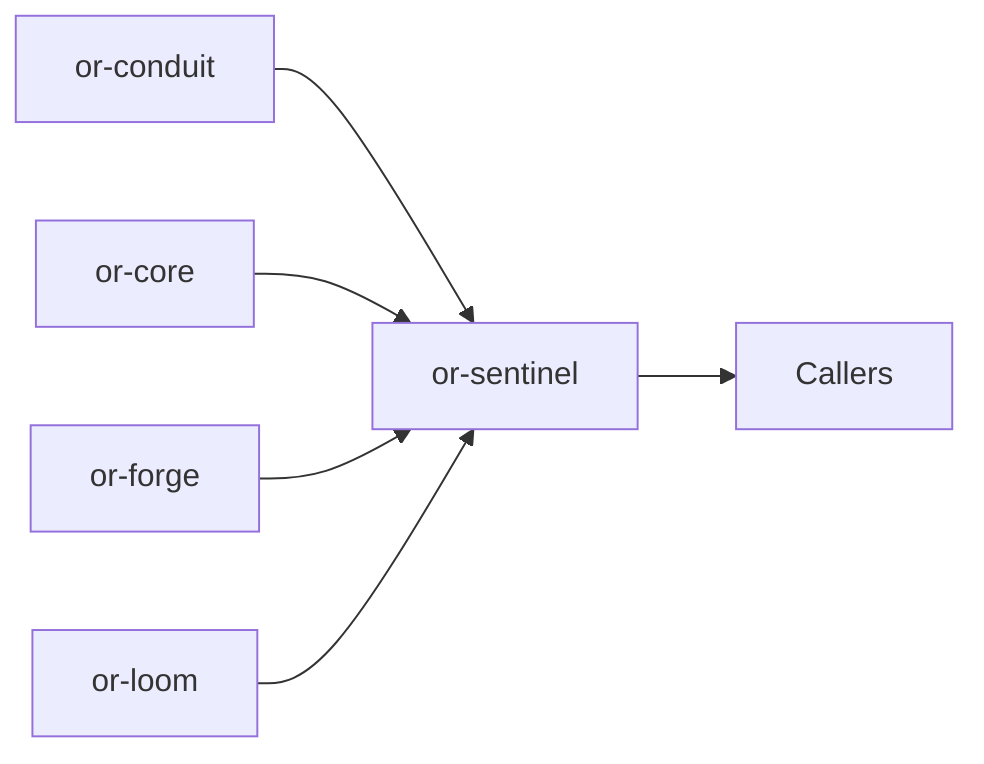

# or-sentinel

**Status**: Partial | **Version**: `0.1.3` | **Deps**: serde, serde_json, thiserror, tokio, tracing

Agent runtime crate that implements graph-backed sentinel loops on top of provider completions, tool invocation, and typed dynamic state.

## Position in the Workspace



## Implementation Status

| Component | Status | Notes |
|---|---|---|
| ReAct-style runtime | Complete | `SentinelAgent` uses an internal `ExecutionGraph` to model think, act, and exit nodes. |
| Topology builder | Complete | `SentinelAgentBuilder` can build agents from built-in or custom `LoopTopology` implementations. Custom topologies plug in by overriding `LoopTopology::bind` (or by attaching handlers in `build()` and relying on the trait's no-op default). |
| Plan-and-execute runtime | Partial | `PlanExecuteAgent` remains available, and `PlanExecuteTopology` adds a builder-friendly graph form. |
| Reflection runtime | Partial | `ReflectionTopology` adds bounded self-critique without replacing the legacy constructor. |
| Step context | Complete | Sentinel-internal control data (config, step index, pending/completed tool call, final answer) lives in a `tokio::task_local!` `SentinelStepContext` rather than `__sentinel_*` keys in `DynState`. The user-facing `DynState` only carries `messages`, plan notes, and other application-visible data. |
| Retry classification | Complete | `invoke_with_retry` only retries `ForgeError::Invocation`. Terminal errors (`UnknownTool`, `InvalidArguments`, `DuplicateTool`) short-circuit immediately. |
| Typed error chains | Complete | `SentinelError::Loom` and `SentinelError::Core` wrap the underlying typed error via `#[from]`. Pattern-match on the inner error to recover full context. |

## Public Surface

- `LoopTopology` (trait): Additive extension point for custom sentinel loop shapes.
- `SentinelAgentBuilder` (struct): Builder path for constructing sentinel agents from built-in or custom topologies.
- `ReActTopology`, `PlanExecuteTopology`, and `ReflectionTopology` (structs): Built-in loop topologies for legacy ReAct, sequential plan execution, and bounded self-critique flows.
- `StepOutcome` (enum): Outcome of a single agent step or full run.
- `SentinelConfig` (struct): Configuration for max steps, token budget, and tool retry policy.
- `PlanStep` (struct): Single step in the plan-and-execute flow.
- `SentinelAgentTrait` (trait): Async contract for running or stepping a sentinel agent.
- `PlanExecuteAgentTrait` (trait): Async contract for plan creation and plan execution.
- `SentinelAgent` (struct): Graph-backed think-act agent runtime over a provider and forge registry.
- `PlanExecuteAgent` (struct): Higher-level planner that delegates individual steps to a sentinel worker.
- `SentinelOrchestrator` (struct): Application helper for agent setup and top-level execution.
- `SentinelError` (enum): Error type for malformed state, provider/tool failures, and serialization issues.
- `SentinelAgent::graph_inspection()` (method): Structural view into the underlying `or-loom` graph for testing and topology comparisons.

## Runtime Shape

- `SentinelAgent::new(provider, registry)` still builds the legacy internal graph with `think`, `act`, and `exit` nodes.
- `SentinelAgentBuilder::new()` preserves the legacy ReAct topology by default, but can also accept `ReActTopology`, `PlanExecuteTopology`, `ReflectionTopology`, or a custom `LoopTopology`.
- Built-in `PlanExecuteTopology` stores the generated plan under `plan` and the completed step order under `plan_execution_order`.
- Built-in `ReflectionTopology` records the bounded critique count under `reflection_iterations`.
- State is carried as `DynState` and must contain `messages` for agent execution.
- Tool results are written back into message history as `MessageRole::Tool` observations.

## Topology Builder

```rust
use or_forge::ForgeRegistry;
use or_sentinel::{ReflectionTopology, SentinelAgentBuilder};

# fn make_agent<P>(provider: P) -> Result<(), or_sentinel::SentinelError>
# where
#     P: or_conduit::ConduitProvider + Clone + Send + Sync + 'static,
# {
let _agent = SentinelAgentBuilder::new()
    .topology(ReflectionTopology::new(2))
    .conduit(provider)
    .tool_registry(ForgeRegistry::new())
    .build()?;
# Ok(())
# }
```

## Known Gaps & Limitations

- Decision and plan parsing still depend on JSON-ish model output rather than provider-enforced structured mode.
- The legacy `SentinelAgent::new` path intentionally keeps the fixed think/act/exit topology for backward compatibility.
