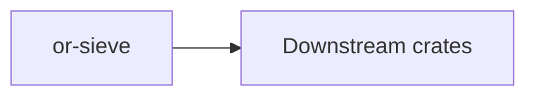

# or-sieve

**Status**: 🟢 Complete | **Version**: `0.1.1` | **Deps**: schemars, serde, serde_json, thiserror, tracing

Structured-output parsing crate built around JSON Schema validation and text parsing helpers.

## Position in the Workspace

## Implementation Status

| Component | Status | Notes |
|---|---|---|
| Schema contract | 🟢 | `JsonSchemaOutput` defines the schema source for structured responses. |
| Structured parser | 🟢 | `JsonParser<T>` validates JSON against a schema before deserializing. |
| Plain-text parser | 🟢 | `TextParser` normalizes and rejects empty text. |

## Public Surface

- `JsonSchemaOutput` (trait): Trait for types that can declare their own JSON Schema.
- `StructuredParser` (trait): Trait implemented by parsers that produce typed structured output.
- `JsonParser` (struct): Structured parser that validates raw JSON against a schema then deserializes it.
- `TextParser` (struct): Parser that trims and validates plain text responses.
- `PlainText` (struct): Simple wrapper for plain text output.
- `SieveOrchestrator` (struct): Application helper for structured and plain-text parsing.
- `SieveError` (enum): Error type for invalid JSON, schema violations, deserialization failures, and empty text.

⚠️ Known Gaps & Limitations
- Validation is centered on the schema shapes currently produced in this repository rather than every JSON Schema feature.
