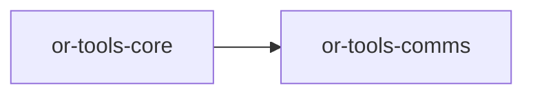

# or-tools-comms

**Status**: Implemented | **Version**: `0.1.3` | **Default features**: `(none)` | **Feature flags**: `twilio`, `telegram`, `discord`, `whatsapp`, `facebook`, `messenger`, `all`

Communication tools for Orchustr. The crate defines normalized outbound message entities, routes messages to channel-specific senders, and provides feature-gated HTTP integrations for SMS and chat platforms.

## In Plain Language

This crate is the outbound communication layer. Its job is to take one normalized message shape, figure out which sender matches the requested channel, and hand the message off to the right platform such as SMS, Telegram, Discord, WhatsApp, Facebook, or Messenger.

For a non-technical teammate, this crate answers the question "how does the agent send something to a person?" For contributors, it provides the extension point for adding more channels while keeping the rest of the system insulated from each platform's API details.

## Responsibilities

- Define the common message, send-result, social-post, and communication error types.
- Provide the `MessageSender` contract used by outbound channel implementations.
- Route a normalized `Message` to the first registered sender that matches its channel.
- Expose that send path through the shared Orchustr `Tool` interface.
- Keep social reading as a domain-level extension point for now rather than pretending it is fully implemented.

## Position in the Workspace

## Implementation Status

| Component | Status | Notes |
|---|---|---|
| Domain contracts | Implemented | `MessageSender`, `SocialReader`, message entities, and `CommsError` are present and re-exported. |
| Orchestration | Implemented | `CommsOrchestrator` routes to the first sender whose `channel()` matches the lowercased `Channel` name. |
| Tool adapter | Implemented | `CommsTool` exposes message sending through `Tool`. |
| Messaging backends | Implemented | Twilio, Telegram, Discord, WhatsApp, Facebook, and Messenger senders exist behind feature flags. |
| Social reading backends | Partial | `SocialReader` exists as a trait, but no concrete `SocialReader` implementation is wired in `src/infra/`. |
| Unit tests | Implemented | `tests/unit_suite.rs` covers sender routing, unsupported channels, tool invocation, and invalid payloads. |

## Public Surface

- `MessageSender` (trait): async contract for outbound senders.
- `SocialReader` (trait): async contract for social/feed readers.
- `Channel` (enum): normalized outbound channel selector.
- `Message` (struct): outbound message envelope.
- `SendResult` (struct): normalized send result with message ID and status.
- `SocialPost` (struct): normalized social post record.
- `CommsError` (enum): crate-local transport and validation error model.
- `CommsOrchestrator` (struct): routing layer across registered senders.
- `CommsTool` (struct): `Tool` adapter over the orchestrator.

## Feature Flags and Backends

| Feature | Module | Main type | Channel | Config from env |
|---|---|---|---|---|
| `twilio` | `infra/twilio.rs` | `TwilioSender` | `sms` | `TWILIO_ACCOUNT_SID`, `TWILIO_AUTH_TOKEN`, `TWILIO_FROM` |
| `telegram` | `infra/telegram.rs` | `TelegramSender` | `telegram` | `TELEGRAM_BOT_TOKEN` |
| `discord` | `infra/discord.rs` | `DiscordSender` | `discord` | `DISCORD_BOT_TOKEN` |
| `whatsapp` | `infra/whatsapp.rs` | `WhatsAppSender` | `whatsapp` | `WHATSAPP_ACCESS_TOKEN`, `WHATSAPP_PHONE_NUMBER_ID` |
| `facebook` | `infra/facebook.rs` | `FacebookSender` | `facebook` | `FACEBOOK_PAGE_ACCESS_TOKEN` |
| `messenger` | `infra/messenger.rs` | `MessengerSender` | `messenger` | `MESSENGER_PAGE_ACCESS_TOKEN` |

## Dependencies

- Internal crates: `or-tools-core`
- External crates: async-trait, base64, reqwest, serde, serde_json, thiserror, tokio, tracing, url

## Known Gaps & Limitations

- No provider ships in the default feature set; at least one backend feature must be enabled to use real senders.
- `SocialReader` is part of the public domain API, but the current infra layer only implements `MessageSender`.
- `CommsOrchestrator` matches channels using `format!("{:?}", msg.channel).to_lowercase()`, so routing depends on the enum debug names staying aligned with sender `channel()` strings.
