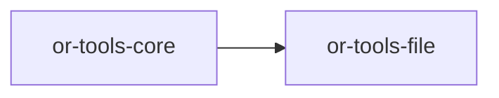

# or-tools-file

**Status**: Implemented | **Version**: `0.1.3` | **Default features**: `local`, `json-toolkit` | **Feature flags**: `local`, `json-toolkit`, `gdrive`, `arxiv`, `financial`, `all`

File and external data-source tools for Orchustr. The crate defines normalized file/data entities, wraps file stores and data sources behind async traits, and ships both local backends and feature-gated HTTP integrations.

## In Plain Language

This crate covers two closely related jobs: working with file-like storage and pulling structured data from external sources. That means it can read and write local files, but it can also act like a gateway to things such as Google Drive, ArXiv, JSON path lookups, and financial market snapshots.

For non-technical readers, the easiest mental model is "get me the file or fetch me the data." For contributors, this crate is where storage-style tools and lightweight external data connectors live. It is intentionally separate from search, browsing, and document parsing so each concern stays focused.

## Responsibilities

- Define the common `FileStore` and `DataSource` contracts.
- Normalize file listings, file content, research-paper records, and financial records.
- Expose file-store operations and data-source fetches through the shared Orchustr `Tool` model.
- Provide local filesystem support plus optional remote data integrations.
- Stop at access and retrieval; document chunking belongs to `or-tools-loaders`, and vector retrieval belongs to `or-tools-vector`.

## Position in the Workspace

## Implementation Status

| Component | Status | Notes |
|---|---|---|
| Domain contracts | Implemented | `FileStore`, `DataSource`, file/data entities, and `FileError` are present and re-exported. |
| Orchestration | Implemented | `FileOrchestrator` wraps store reads with tracing. |
| Tool adapters | Implemented | `FileStoreTool` and `DataSourceTool` expose store and source operations through `Tool`. |
| Local file backend | Implemented | `LocalFileSystem` ships behind the default `local` feature. |
| JSON data backend | Implemented | `JsonToolkit` ships behind the default `json-toolkit` feature. |
| Remote data backends | Implemented | Google Drive, ArXiv, and Financial Datasets integrations are feature-gated in `src/infra/`. |
| Unit tests | Implemented | `tests/unit_suite.rs` covers in-memory store behavior, tool dispatch, and JSON path resolution. |

## Public Surface

- `FileStore` (trait): async contract for read, write, list, and delete operations.
- `DataSource` (trait): async contract for external data fetchers returning JSON values.
- `FileEntry` (struct): directory-style listing entry with size and optional modified timestamp.
- `FileContent` (struct): normalized file read result.
- `JsonQuery` (struct): JSON query envelope using jq-style path segments.
- `ResearchPaper` (struct): normalized ArXiv-style paper record.
- `FinancialRecord` (struct): normalized market snapshot record.
- `FileError` (enum): crate-local error model and conversion source for `ToolError`.
- `FileOrchestrator` (struct): store wrapper used by higher-level callers.

## Feature Flags and Backends

| Feature | Module | Main type | Role | Config from env |
|---|---|---|---|---|
| `local` | `infra/local_fs.rs` | `LocalFileSystem` | Local read/write/list/delete against the host filesystem | none |
| `json-toolkit` | `infra/json_toolkit.rs` | `JsonToolkit` | Resolve a JSON value by path segments | none |
| `gdrive` | `infra/gdrive.rs` | `GoogleDriveStore` | Google Drive-backed `FileStore` | `GDRIVE_ACCESS_TOKEN` |
| `arxiv` | `infra/arxiv.rs` | `ArxivSource` | ArXiv query-backed `DataSource` | none |
| `financial` | `infra/financial.rs` | `FinancialDatasetsSource` | Financial snapshot `DataSource` | `FINANCIAL_DATASETS_API_KEY` |

## Dependencies

- Internal crates: `or-tools-core`
- External crates: async-trait, reqwest, serde, serde_json, thiserror, tokio, tracing, url

## Known Gaps & Limitations

- `FileOrchestrator` currently exposes only `read`; write/list/delete live on `FileStoreTool` or the underlying `FileStore`.
- `GoogleDriveStore::read()` and `delete()` treat `path` as a Drive file ID, while `write()` uses `path` as the created file name.
- `ArxivSource` uses lightweight Atom parsing and currently leaves `authors` and `categories` empty.
- `LocalFileSystem::delete()` uses `tokio::fs::remove_file`, so directory deletion is not supported by this backend.
