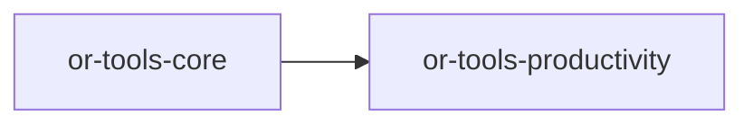

# or-tools-productivity

**Status**: Implemented | **Version**: `0.1.3` | **Default features**: `(none)` | **Feature flags**: `gmail`, `gcalendar`, `slack`, `jira`, `github`, `trello`, `notion`, `clickup`, `office365`, `all`

Productivity tools for Orchustr. The crate defines async contracts for email, calendar, project tracking, knowledge bases, and team messaging, then wires feature-gated HTTP integrations behind a single orchestrator and `Tool` adapter.

## In Plain Language

This crate is the "work apps" layer for Orchustr. It brings together common workplace systems such as email, calendars, issue trackers, knowledge bases, and team chat so an agent can interact with them through one shared model instead of one-off provider code everywhere else in the repo.

For non-technical readers, this is the crate that helps an agent work with the tools people already use day to day. For contributors, it is where provider integrations like Gmail, Google Calendar, Jira, GitHub, Slack, Notion, ClickUp, Trello, and Outlook are normalized behind shared capability traits.

## Responsibilities

- Define shared capability contracts for email, calendar, project tracking, knowledge, and team messaging.
- Hold optional provider clients inside one orchestrator so callers can compose only what they need.
- Expose a common `Tool` facade for the currently supported cross-provider operations.
- Normalize returned emails, events, issues, pages, and related productivity records.
- Keep provider-specific advanced behavior out of the generic tool surface unless the code explicitly supports it.

## Position in the Workspace

## Implementation Status

| Component | Status | Notes |
|---|---|---|
| Domain contracts | Implemented | Email, calendar, tracker, knowledge-base, and messenger traits are present and re-exported. |
| Orchestration | Implemented | `ProductivityOrchestrator` stores optional clients and is configured through builder-style `with_*` methods. |
| Tool adapter | Partial | `ProductivityTool` supports `list_emails`, `list_events`, `list_issues`, `search_knowledge`, and `post_message`; create/send operations on the traits are not yet surfaced through the generic tool. |
| Provider backends | Implemented | Gmail, Google Calendar, Slack, Jira, GitHub, Trello, Notion, ClickUp, and Office365 modules exist behind feature flags. |
| Office365 coverage | Partial | `office365.rs` implements Outlook email and Outlook calendar clients, not Teams or OneDrive clients. |
| Unit tests | Implemented | `tests/unit_suite.rs` covers each supported tool op, unknown ops, and missing-client errors. |

## Public Surface

- `EmailClient` (trait): list and send email operations.
- `CalendarClient` (trait): list and create calendar events.
- `ProjectTracker` (trait): list and create work items/issues.
- `KnowledgeBase` (trait): search and create pages/documents.
- `TeamMessenger` (trait): post and search team messages.
- `Email`, `CalendarEvent`, `Issue`, `Page`, `ProductivityTask` (structs): normalized workspace entities.
- `ProductivityError` (enum): crate-local transport, validation, and not-found error model.
- `ProductivityOrchestrator` (struct): optional dependency holder for each capability family.
- `ProductivityTool` (struct): generic `Tool` facade over the orchestrator.

## Feature Flags and Backends

| Feature | Module | Main type | Capability | Config from env |
|---|---|---|---|---|
| `gmail` | `infra/gmail.rs` | `GmailClient` | `EmailClient` | `GMAIL_ACCESS_TOKEN` |
| `gcalendar` | `infra/gcalendar.rs` | `GoogleCalendarClient` | `CalendarClient` | `GOOGLE_CALENDAR_ACCESS_TOKEN` |
| `slack` | `infra/slack.rs` | `SlackMessenger` | `TeamMessenger` | `SLACK_BOT_TOKEN` |
| `jira` | `infra/jira.rs` | `JiraTracker` | `ProjectTracker` | `JIRA_BASE_URL`, `JIRA_EMAIL`, `JIRA_API_TOKEN` |
| `github` | `infra/github.rs` | `GitHubTracker` | `ProjectTracker` | `GITHUB_TOKEN`, `GITHUB_OWNER`, `GITHUB_REPO` |
| `trello` | `infra/trello.rs` | `TrelloTracker` | `ProjectTracker` | `TRELLO_API_KEY`, `TRELLO_TOKEN`, `TRELLO_LIST_ID` |
| `notion` | `infra/notion.rs` | `NotionBase` | `KnowledgeBase` | `NOTION_API_KEY`, `NOTION_DATABASE_ID` |
| `clickup` | `infra/clickup.rs` | `ClickUpTracker` | `ProjectTracker` | `CLICKUP_API_KEY`, `CLICKUP_LIST_ID` |
| `office365` | `infra/office365.rs` | `OutlookEmailClient`, `OutlookCalendarClient` | `EmailClient`, `CalendarClient` | `OFFICE365_ACCESS_TOKEN` |

## Dependencies

- Internal crates: `or-tools-core`
- External crates: async-trait, base64, reqwest, serde, serde_json, thiserror, tokio, tracing, url

## Known Gaps & Limitations

- No provider is enabled by default; real integrations require explicit feature flags and environment configuration.
- `ProductivityTool` does not yet expose trait methods like `send_email`, `create_event`, `create_issue`, `create_page`, or `search_messages`.
- `ProductivityTask` is part of the public entity model but is not currently returned by the orchestrator or tool adapter.
- The `office365` feature currently covers Outlook email and Outlook calendar only.
