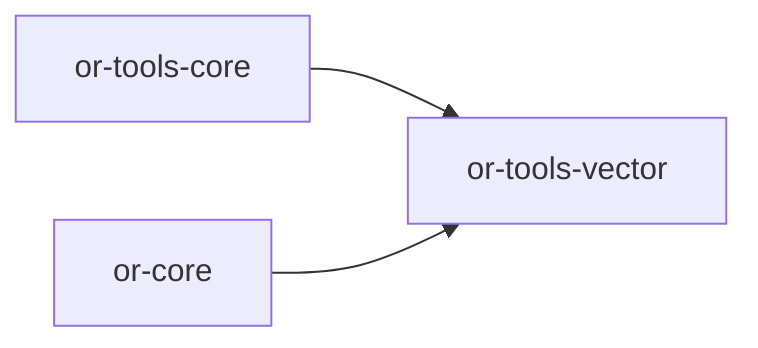

# or-tools-vector

**Status**: Implemented | **Version**: `0.1.3` | **Default features**: `(none)` | **Feature flags**: `pinecone`, `weaviate`, `qdrant`, `chroma`, `milvus`, `pgvector`, `all`

Feature-gated vector store integrations for Orchustr retrieval and RAG flows. The crate defines a normalized vector-store contract, shared collection/query/upsert entities, a thin `RagOrchestrator`, and feature-gated backends for managed and self-hosted vector databases.

## In Plain Language

This crate is the storage and retrieval layer for embeddings and nearest-neighbor search. It gives Orchustr one common way to create vector collections, write vectors, query for similar items, and delete stored records even when the actual database changes underneath.

If you are thinking in RAG terms, `or-tools-vector` is where "store the chunks" and "find the closest matches" live. It does not create embeddings by itself and it does not parse documents by itself. Those jobs stay outside this crate so the vector layer can stay focused on vector-database behavior.

## Responsibilities

- Define the common vector-store contract and normalized collection/query/upsert/delete types.
- Provide a thin orchestrator and tool adapter for vector operations.
- Hide backend-specific APIs behind one shared Rust interface.
- Support both managed and self-hosted vector databases through feature flags.
- Stop at vector storage and similarity lookup; embedding generation and document loading belong to other layers.

## Position in the Workspace

## Implementation Status

| Component | Status | Notes |
|---|---|---|
| Domain contracts | Implemented | `VectorStoreClient`, `Distance`, collection/query/upsert/delete types, and `VectorError` are present and re-exported. |
| Orchestration | Implemented | `RagOrchestrator<C>` adds tracing around `upsert` and `query`. |
| Tool adapter | Implemented | `VectorStoreTool<C>` exposes `ensure_collection`, `upsert`, `query`, and `delete` through `Tool`. |
| Backend modules | Implemented | `pinecone`, `weaviate`, `qdrant`, `chroma`, `milvus`, and `pgvector` are feature-gated in `src/infra/`. |
| Unit tests | Implemented | `tests/unit_suite.rs` covers upsert, query, tool dispatch, and enum serialization with a stub store. |

## Public Surface

- `VectorStoreClient` (trait): async contract implemented by each backend.
- `Distance` (enum): normalized metric selection.
- `CollectionConfig` (struct): collection/table creation settings.
- `UpsertItem` and `UpsertBatch` (structs): vector upsert payloads.
- `DeleteRequest` (struct): deletion payload by collection and IDs.
- `QueryFilter` (struct): vector query envelope with `top_k` and optional metadata filter.
- `VectorMatch` (struct): normalized query result item.
- `VectorError` (enum): vector-specific error model and conversion to `ToolError`.
- `RagOrchestrator` (struct): thin orchestrator around a `VectorStoreClient`.

## Feature Flags and Backends

| Feature | Module | Main type | Config from env |
|---|---|---|---|
| `pinecone` | `infra/pinecone.rs` | `PineconeClient` | `PINECONE_HOST`, `PINECONE_API_KEY` |
| `weaviate` | `infra/weaviate.rs` | `WeaviateClient` | `WEAVIATE_URL`, optional `WEAVIATE_API_KEY` |
| `qdrant` | `infra/qdrant.rs` | `QdrantClient` | `QDRANT_URL`, optional `QDRANT_API_KEY` |
| `chroma` | `infra/chroma.rs` | `ChromaClient` | optional `CHROMA_URL`, otherwise `http://localhost:8000` |
| `milvus` | `infra/milvus.rs` | `MilvusClient` | `MILVUS_URL`, optional `MILVUS_TOKEN` |
| `pgvector` | `infra/pgvector.rs` | `PgVectorClient` | `PGVECTOR_DATABASE_URL` |

## Dependencies

- Internal crates: `or-core`, `or-tools-core`
- External crates: async-trait, reqwest, serde, serde_json, thiserror, tokio, tracing, url
- Optional external crates: `sqlx` behind `pgvector`

## Known Gaps & Limitations

- The default build compiles no vector backend; callers must opt into one or more features.
- `PineconeClient::ensure_collection` is a no-op because Pinecone index creation is documented in code as a control-plane concern.
- `PgVectorClient` assumes one Postgres table per collection and requires `CREATE EXTENSION IF NOT EXISTS vector` before use.
