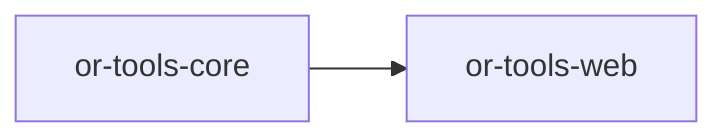

# or-tools-web

**Status**: Implemented | **Version**: `0.1.3` | **Default features**: `requests` | **Feature flags**: `requests`, `playwright`, `brightdata`, `hyperbrowser`, `agentql`, `oxylabs`, `all`

Web-browsing and scraping tools for Orchustr. The crate defines normalized fetch and scrape types, validates URL safety, exposes browser and scraper adapters through `Tool`, and ships multiple feature-gated backends ranging from raw HTTP fetches to managed browser services.

## In Plain Language

This crate is what Orchustr uses when it needs to actually visit a URL. It can fetch pages like a lightweight HTTP client, or it can hand the job to browser-style backends and scrapers when a site needs rendering or structured extraction.

For less technical readers, the simple mental model is: `or-tools-search` helps discover links, while `or-tools-web` helps open those links and bring the content back in a safe, predictable format. For contributors, this is the place where browser-style integrations live and where URL safety checks are enforced before network work begins.

## Responsibilities

- Define common fetch and scrape contracts and normalized response types.
- Validate URL schemes before a backend is allowed to fetch a page.
- Adapt browser and scraper implementations into the shared Orchustr `Tool` model.
- Provide feature-gated backends ranging from simple requests to managed browser services.
- Stop at retrieval and extraction; ranking search results belongs to `or-tools-search`, and persistence belongs elsewhere.

## Position in the Workspace

## Implementation Status

| Component | Status | Notes |
|---|---|---|
| Domain contracts | Implemented | `WebBrowser`, `Scraper`, `FetchRequest`, `FetchResponse`, `ScrapedPage`, and `WebError` are present and re-exported. |
| Orchestration | Implemented | `WebOrchestrator` validates URLs and delegates fetches to the configured browser. |
| Tool adapters | Implemented | `BrowserTool<B>` and `ScraperTool<S>` adapt browser and scraper implementations to `Tool`. |
| Browser backends | Implemented | `requests`, `playwright`, `brightdata`, `hyperbrowser`, and `oxylabs` implement `WebBrowser`. |
| Scraper backends | Implemented | `agentql` implements `Scraper`. |
| Unit tests | Implemented | `tests/unit_suite.rs` covers URL validation, unsafe scheme rejection, fetch path, scraper path, and HTTP method serialization. |

## Public Surface

- `WebBrowser` (trait): contract for fetch-style web access.
- `Scraper` (trait): contract for structured scrape/extraction behavior.
- `HttpMethod` (enum): normalized HTTP verbs used by `FetchRequest`.
- `FetchRequest` (struct): browser request envelope with headers, body, render flag, and optional timeout.
- `FetchResponse` (struct): normalized fetch result with status, body, headers, and optional final URL.
- `ScrapedPage` (struct): normalized scrape result containing title, text, and links.
- `WebError` (enum): URL validation, transport, upstream, parse, and capability error model.
- `WebOrchestrator` (struct): validated browser fetch entry point.

## Feature Flags and Backends

| Feature | Module | Main type | Trait | Config from env |
|---|---|---|---|---|
| `requests` | `infra/http_client.rs` | `RequestsClient` | `WebBrowser` | none |
| `playwright` | `infra/playwright.rs` | `PlaywrightBrowser` | `WebBrowser` | `PLAYWRIGHT_ENDPOINT` |
| `brightdata` | `infra/brightdata.rs` | `BrightDataScraper` | `WebBrowser` | `BRIGHTDATA_API_TOKEN`, optional `BRIGHTDATA_ZONE` |
| `hyperbrowser` | `infra/hyperbrowser.rs` | `HyperbrowserClient` | `WebBrowser` | `HYPERBROWSER_API_KEY` |
| `agentql` | `infra/agentql.rs` | `AgentQlScraper` | `Scraper` | `AGENTQL_API_KEY` |
| `oxylabs` | `infra/oxylabs.rs` | `OxylabsScraper` | `WebBrowser` | `OXYLABS_USERNAME`, `OXYLABS_PASSWORD` |

## Dependencies

- Internal crates: `or-tools-core`
- External crates: async-trait, reqwest, serde, serde_json, thiserror, tokio, tracing, url

## Known Gaps & Limitations

- URL validation only allows `http` and `https`; other schemes are rejected before any backend call is made.
- The default build only includes the `requests` backend.
- `WebOrchestrator` wraps browser fetches only; scrape flows are exposed separately through `ScraperTool`.
